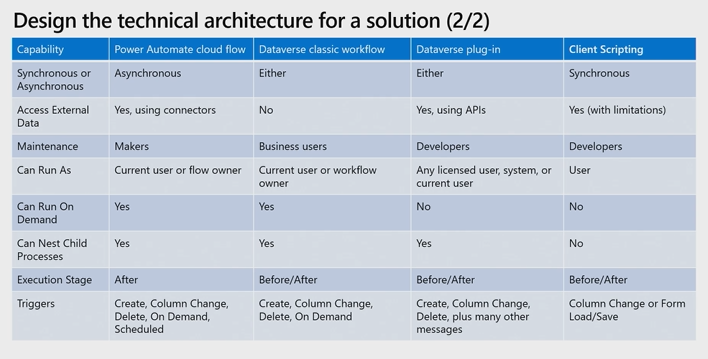

# Create a Technical Design

## Intro

This objective is focussed on choosing between different features. This requires
an understanding of the capabilities of the different features.

## Design Technical Architecture

### What we Need to Know

- Calculated Columns
  - Calculated on retrieve
  - Can use on table and columns in many to one relationship

- Rollup Columns
  - Requires one-to-many relationship
  - REcalculated every hour
  - Max 100 per env and 10 per table
  - Supports hierarchical relationships

- Logic Apps
  - Licenced pay-as-you-go (consumption) or part of service plan (standard)
  - Build in Azure Portal or VS
  -
- Power Automate Cloud Flows
  - Licenced through 365 with quota of runs per month
  - Supports approvals and notifications

Consider both Azure

## Design the Authentication and Authorization Strategy

### What we Need to Know

- Authentication
  - Entra ID used to access Power Platform
  - Users can auth with Entra Id tenant credentials
  - When accessing Azure and external systems, we need to define how we
  authenticate against those systems (typically OAuth 2.0)
- Authorisation
  - Entra Id Security Groups
  - Dataverse security roles
  - Resource Sharing

## Assess Suitability of Out-of-the-Box Solutions

### What do we need to know?

That we should use power platform capabilities over writing code where possible
for instance with:

- Rollup columns
- Calculated columns
- Column-level security

We also need to know the limitations to understand when to use other options
such as:

- Power Automate Flows
- Classic Workflows
- Plugins

### Scripts Vs Business Rules

Before writing a script, consider whether business rules would be a more
appropriate solution. We can use business rules to:

- Validate data and show error messages
- Set and clear column values
- Set column requirement levels
- Set column visibility
- Enable or disable columns
- Create business recommendations based on business intelligence.

The last three of these are not available for Canvas Apps, but nor are scripts.

One distinct feature of business rules is that table-scoped rules may
automatically apply logic on the backend where applicable. This can provide
consistency in application regardless of where an action is run.

However, there are limitations with business rules. Client-side scripts may be
better where:

- We need to reference data in a related table
- Logic needs to run on the form save event
- We have complex conditions as a script can be more efficient
- We need to clear values from form data

### Client Scripts Vs Calculated Columns

Calculated columns run logic on retrieve. Any client side changes will not be
reflected in the value of a calculated column until the form refreshes. If we
want data to update instantly a client side script may be preferable.

Client-scripting is often used as a complement to backend implementations such
as calculated columns, rollup columns, plug-ins etc. This can provide a
consistent user experience while also maintaining data consistency and integrity
on the backend.

## Determine where to run Business Logic

Includes:

- Cloud computing
- Client-Side Processing
- Business Rules
- Plug-ins
- Power Automate

## Standard, Virtual and Elastic Containers and Connectors

### What we Need to Know

- Standard Tables
  - Structured model
  - Persistent data
  - Using business logic
- Virtual Table
  - Query external data sources
  - Enhance performance and reduce data redundancy
  - Integrate with legacy systems
- Elastic Tables
  - unstructured or semi-structured data
  - Automatic horizontal scaling
  - High volume of read/write requests
- Connectors
  - Integrate cloud services
  - Leverage APIS
  - Enable third-party integrations

## Assess Security Features

### What we Need to Know

- Data Loss Prevention Policies
  - Find and view
  - Edit
  - Delete
  - Change default data group
  - DLP Powershell commands
- Business Units
  - Root business unit
  - Hierarchical structure
  - Basis of Dataverse Security model
  - Assign Users
  - Create Teams
- Security Roles
  - RBAC
  - Default user security roles
  - Table privileges
  - Access levels
  - Permission settings
  - privacy related privileges
  - miscellaneous privileges

Includes:

- Data Loss Prevention Policies
- Security Roles
- Teams
- Business Units
- Row Sharing

    Determine the impact of security features of the Microsoft Power Platform including data loss prevention (DLP) policies, security roles, teams, business units, and row sharing on your business solution
