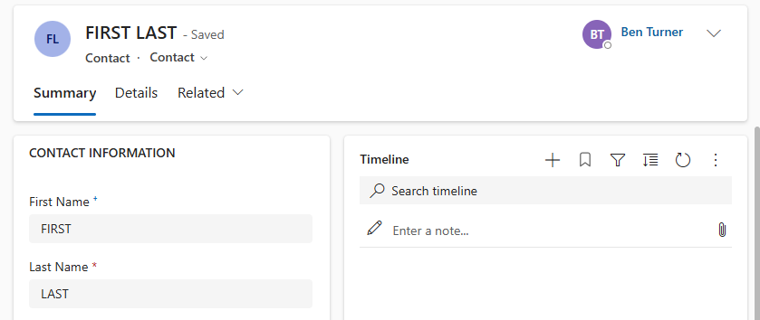
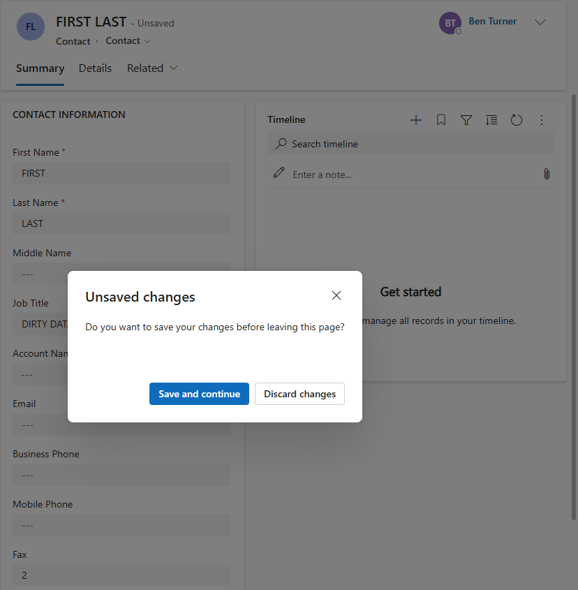
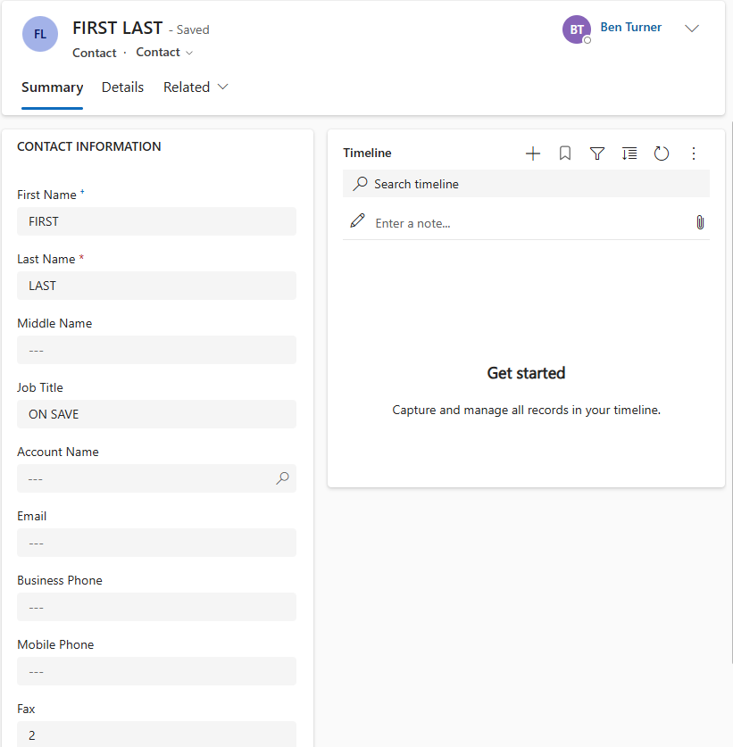

# Form Context Data Demo

This demo focusses on formContext.data. You can view the code
[here](../resources/scripting/form_context_data_demo.js). The script exposes a
single function, contactFormLoadHandler.

## ContactFormLoadHandler

This script is run when a contact form is loaded. The contactFormLoad handler
first checks the validity of the form, if the form is not valid then it uses
data.entity.attributes.get to access and set the required fields, first and last
name.

Note, context.getAttribute() is an alias for this method.

This handler then:

- Sets job title to ON LOAD to indicate the handler from which the field was set
- Registers a post-save handler against the form
- Calls the saveContactFormIfDirty method

## SaveContactFormIfDirty

This method first checks for unsaved changes using the data.isDirty method. If
there are unsaved changes then:

- The form will be saved with data.save
- A save count stored in the fax field is incremented by 1

When this method is called by the contactFormLoadHandler, the data will be dirty
as several fields have been set programmatically. Consequently the form is saved
and the post save handler registered by the ContactFormLoad handler is called.

## ContactFormPostSaveHandler

When this handler is called, the job title field is set to ON SAVE to indicate
the handler from which the field was set. It then calls saveContactFormIfDirty.
Since the job title field has been changed, the form will again be saved which
will trigger a second call to the post save handler.

On the second invocation, the job title field is set to ON SAVE and
saveContactFormIfDirty is called. However, the form data will not have changed
so this will not trigger a third save and the save count, in the fax field, will
remain at 2.

If the save count equals 2, the post save handler will set the job title again
to DIRTY DATA and refresh the form with data.refresh. This triggers a
confirmation dialog warning that any unsaved data will be lost. Selecting
discard changes will reset the reset the job title field to ON SAVE.

