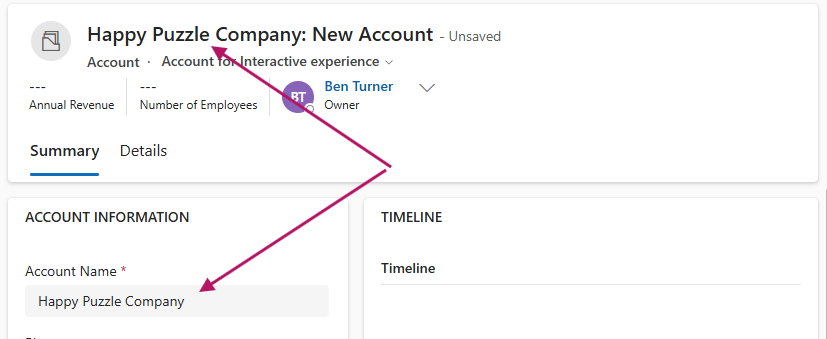
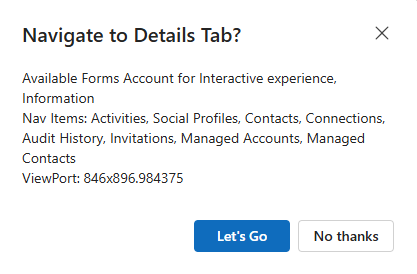
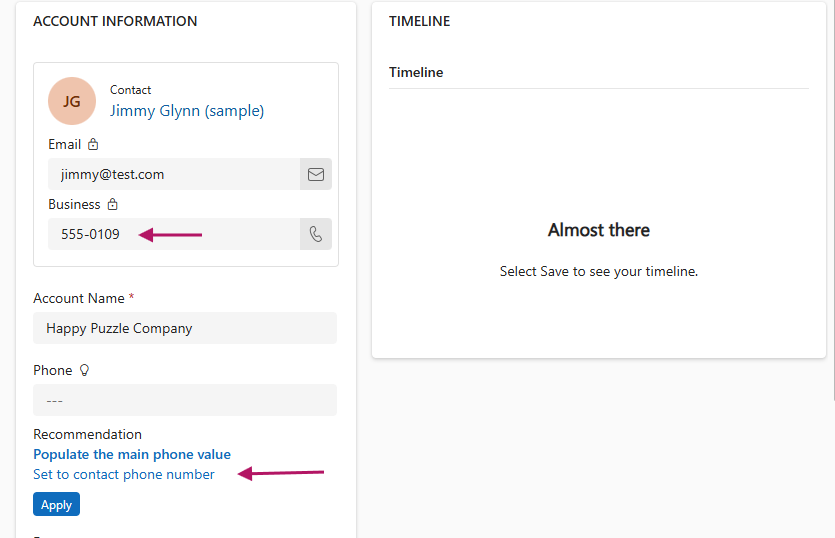
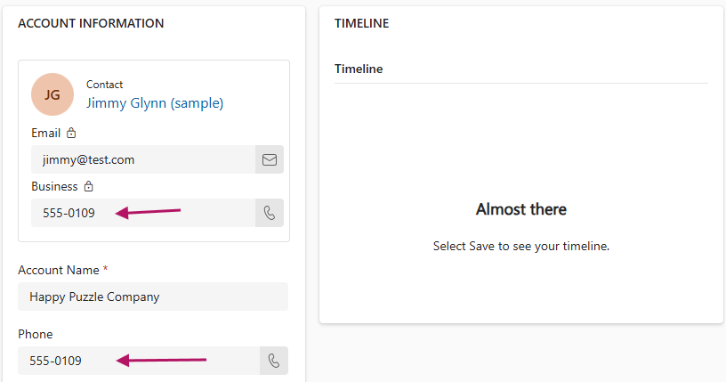

# Form Context UI Demo

This demo is focussed on formContext.ui; the code can be accessed
[here](../resources/scripting/form_context_ui_demo.js). The script exposes a
single function, accountForInteractiveExperienceFormOnLoadHandler. The sole
role of this handler is to register additional demo handlers described below.

## AccountNameOnChangeHandler

This handler updates the form title to the account name when the account name
control changes.

```js
formContext.ui.setFormEntityName(accountName)
```



### AccountFaxOnChangeHandler

This handler accesses metadata on the form with:

```js
ui.formSelector.items.get()
ui.navigation.items.get()
ui.getViewPortWidth()
ui.getViewPortHeight()
```

It then uses Xrm to display a confirmation dialogue with this data.

If confirm is selected, the details tab is accessed and setFocus is used to
navigate to that tab:

```js
const detailsTab = formContext.ui.tabs.get(logicalNames.detailsTab);
detailsTab.setFocus();
```



### PrimaryContactOnChangeHandler

This handler uses advanced features of form level notifications to show a
suggestion with an automated action to run if the suggestion is accepted.

The suggestion will set the account phone number to:

- the contact's phone number, OR
- a default if there is no contact or the contact does not have a phone number




