# Xrm Scripting Demos

## Xrm Navigation and Panel

These demos focus on Xrm.Navigation and Xrm.Panel/Xrm.App. The code can be found
[here](../resources/scripting/xrm_navigation_and_panel_demo.js)

The script exposes a variety of methods which have been attached to command
bar buttons in the account form.

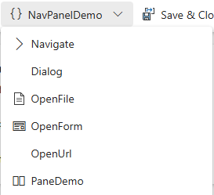

### NavigateTo

The navigateTo function allows us to navigate to a variety of different page
types. The destination can be loaded inline or within a dialog.

This demo opens either an entity list or entity record depending on a boolean
argument passed by the command bar.

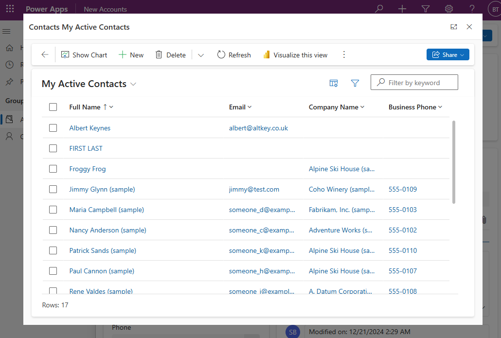

### Dialog Boxes

There are three dialog types:

- Alert
- Confirm
- Error

This demo displays a confirmation dialog. The accept button will trigger an
alert dialog and the cancel button will display an error dialog.

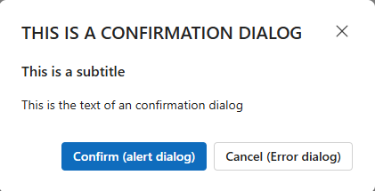

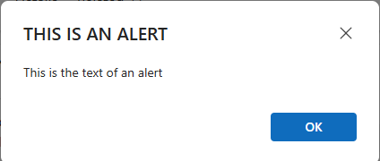

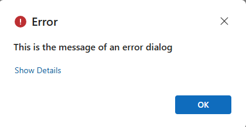

### Open File

This demo uses Xrm.device.pickFile to prompt the user to select a file from
their file system.

It then opens an alert dialog to show the size of the file and uses
Xrm.Device.openFile to open the file which will download it.

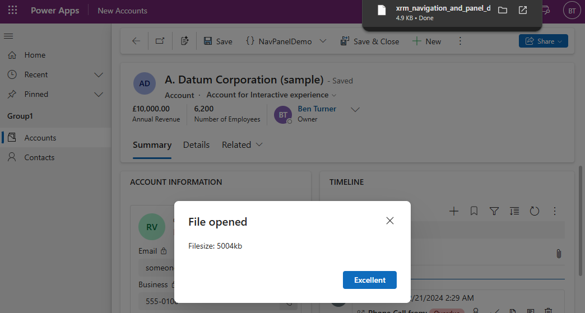

### Open Form

This demo simply opens a form for the account table. The openInNewWindow
property is set to true in the options object. This opens a create account form
in a new tab.

### Open Url

Similar to the above, this opens the given url in a new tab. There is no need
to specify that the url should open in a new tab.

### Create Pane

Xrm has a Panel api in preview. This has a single method, loadPanel which is
depreciated and replaced by Xrm.App.sidePanes.createPane.

The sidePanes api allows us to create multiple panes and load them. The panes
have a navigate method which (other than the name), is consistent with the
navigation.navigateTo method.

The demo creates a new pane and uses navigate to open an entity list of type
account:

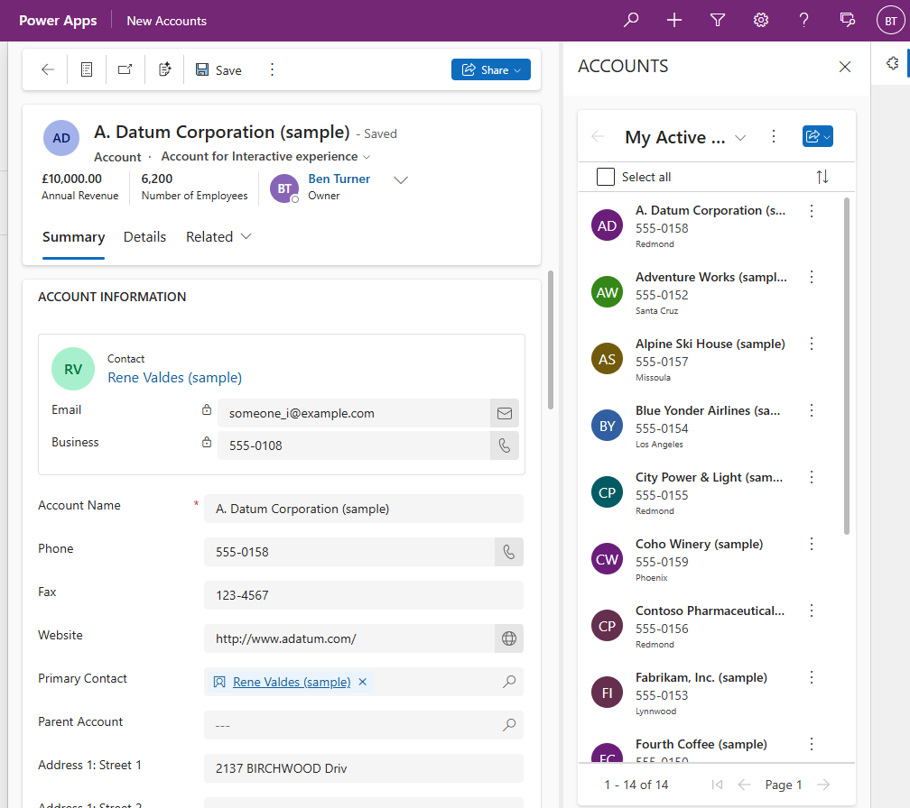

## Xrm Web Api

This demo is focussed on Xrm.WebApi, the code can be found
[here](../resources/scripting/xrm_web_api_demo.js). The script exposes three
handlers intended to be attached to the command bar for the account main grid:

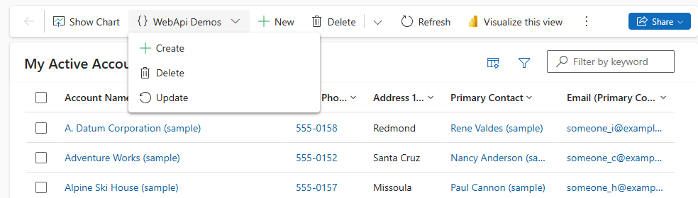

The three handlers are self-explanatory. Note that
Xrm.Utility.showProgressIndicator is used to display a message to the user while
the promises are pending:

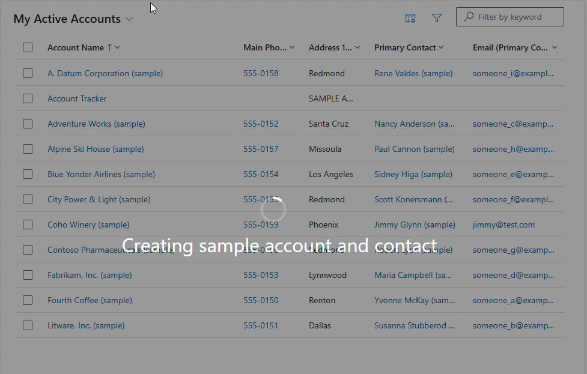

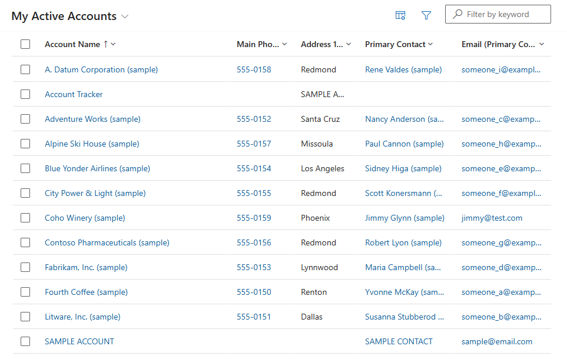

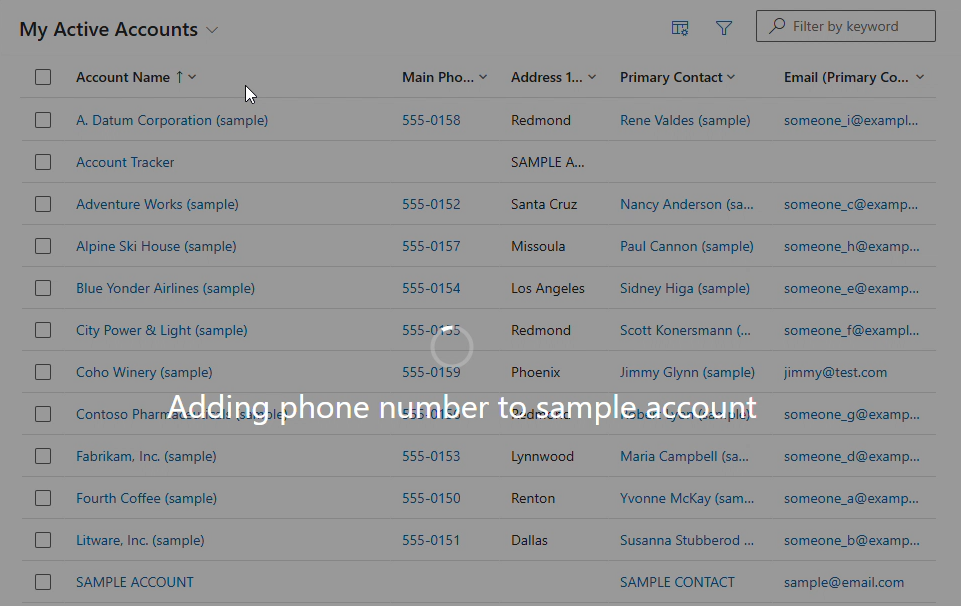

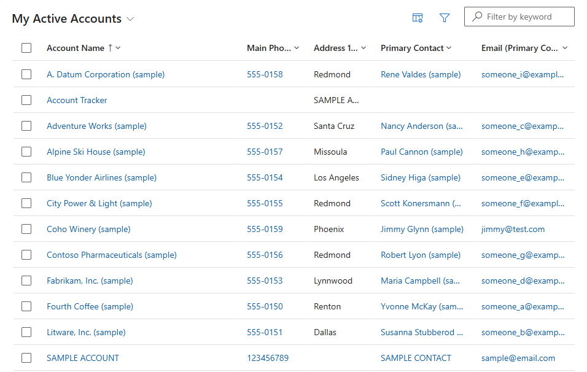

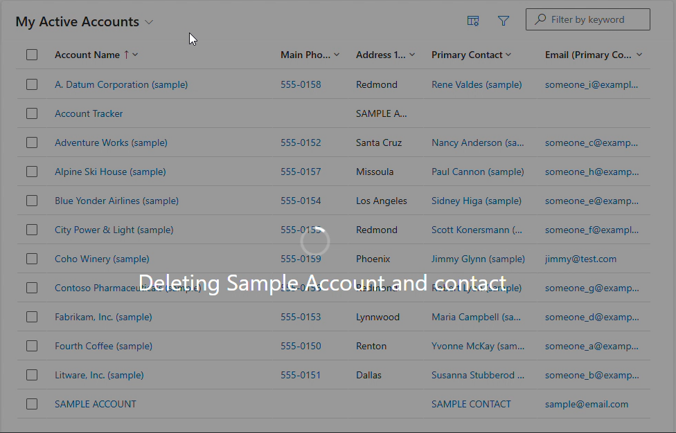
