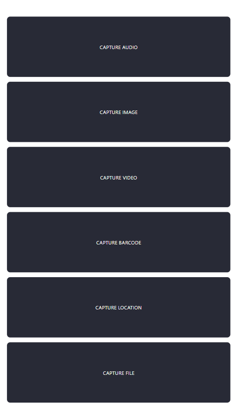
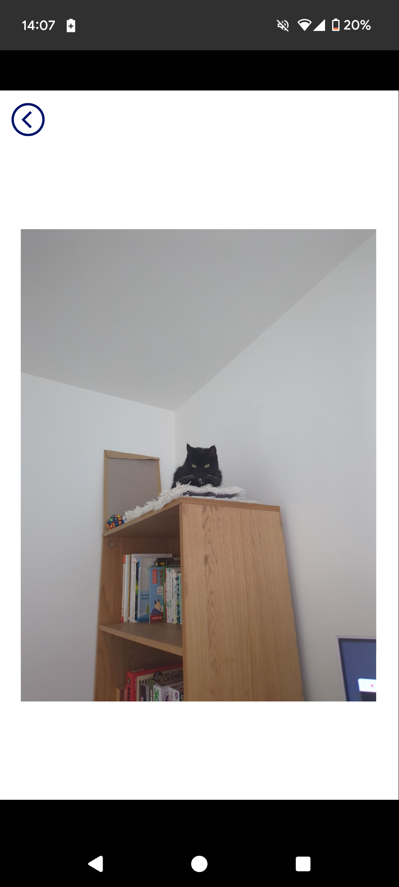
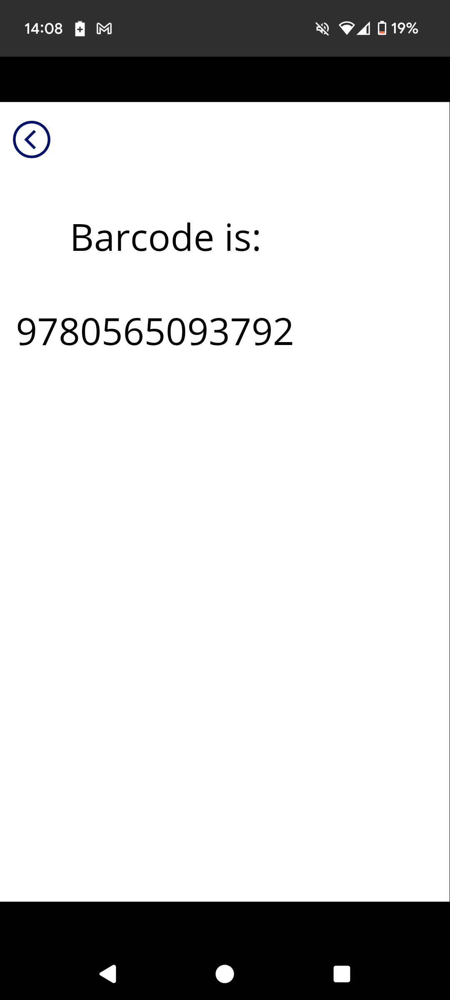
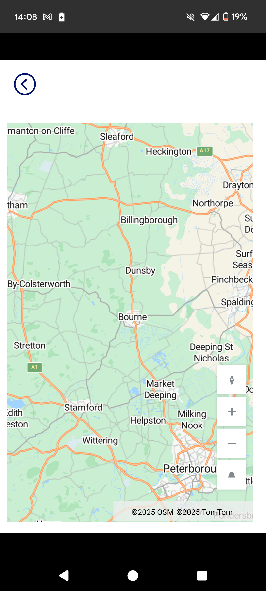

# PCF Components Device Demo

In this demonstration, a PCF component has been developed with a focus on the
device API. In this instance, the
[code](../resources/pcf/DeviceDemo/deviceDemo/index.ts) says more than the
write-up.

## The Component

The component is just a set of buttons used to capture data from the user's
device:

## Manifest

The manifest is very simple, it defines three output properties:

- capturedValue: To send captured values to PowerApps
- capturedValueSource: More user-friendly than parsing the mimetype
- errorMessage: So error can be displayed at a form rather than component level

The resources include a css file with some minimal styling of the buttons

In the feature usage node, the 6 different device features have been enabled.

## The code

The code is straight forward, 6 buttons are created and click handlers are
attached.

The main thing to be aware of is the **this** bindings. The component took
an hour to build and a day to debug. I do not have a good understanding of JS
classes, but the **this** keyword is not intuitive and will not necessarily
refer to the object instance.

## Some Screenshots

My phone does not support all of the functionality in this component, but I can
demonstrate:

### Capture Image

### Capture Barcode

### Capture Location

