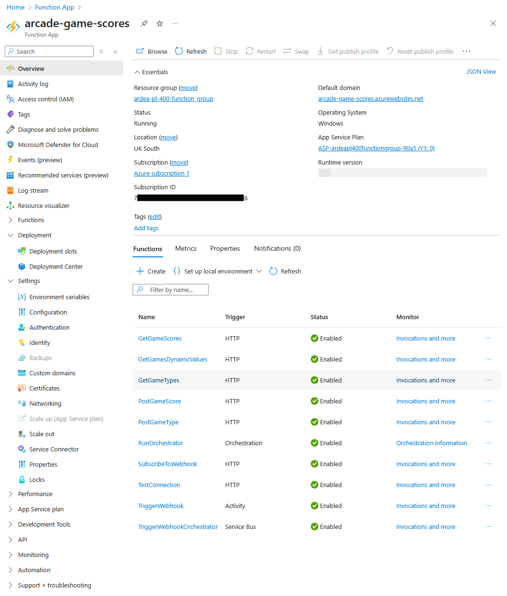

# Azure Functions Demo

## Introduction

An Azure function app was created to act as an API for a demonstration of
[custom connectors](./custom_connectors_arcade_scores_demo.md). That demo is
focussed on configuring the custom connector for the API. In this document, I
will add some explanation of the code for the Azure Function.

## Azure Set-Up

I first created an Azure Function App project using portal.azure. Obviously, at
the point of creation the functions section was empty.



## Scaffolding the Project

Next I used the command palette to scaffold the function app.

## Write the Code

From the screenshot above, you can see that a number of functions have been
written using a variety of triggers. I will cover a few of these:

### GetGameScores

The code for this function can be found
[here](../resources/CustomConnectors/ArcadeScoresAPI/Functions/GamesFunction.cs).

First, the function signature:

```cs
    [Function(nameof(GetGameScores))]
    public static async Task<HttpResponseData> GetGameScores(
        [HttpTrigger(AuthorizationLevel.Function, "get", Route = "scores/{game}")]
            HttpRequestData req,
        [SqlInput(
            commandText: "SELECT Id, game, gamerTag, teamName, score, "
                + "CONVERT(VARCHAR(8), duration, 108) AS duration "
                + "FROM dbo.GameScores "
                + "WHERE game = @game",
            commandType: System.Data.CommandType.Text,
            parameters: "@game={game}",
            connectionStringSetting: "SqlConnectionString"
        )]
            IEnumerable<GameScore> gameScores,
        FunctionContext context
    )
```

The annotation at the top specifies that the method is a function with a given
name. This will ensure that it is added as a function when the project is
published to the Azure Function App.

The method of the trigger is set to GET and the route to scores/{game}. The
dynamic value game represents the guid of a game in the database.

This app interacts with an Azure SQL database, we can use the SQLInput
annotation to create a sql input binding. This will make the query using the
specified connection string and store the result in gameScores. This enables us
to simply access gameScores in the method without having to connect to the DB
and parse the results.

Next, the body of the method:

```cs
var logger = context.GetLogger(nameof(gameScores));
try
{
    var response = req.CreateResponse(HttpStatusCode.OK);
    await response.WriteAsJsonAsync(gameScores);
    return response;
}
catch (Exception ex)
{
    logger.LogError(ex.ToString());
    var response = req.CreateResponse(HttpStatusCode.InternalServerError);
    await response.WriteAsJsonAsync(new { error = "An unexpected error occurred." });
    return response;
}
```

Logger is used to post logs to the console. We can access these logs in
portal.azure. It is a useful way to debug the application.

The happy path code returns gameScores as an OK response.

### SubscribeToWebhook

This function is used to register a webhook with the application. The function
was written to support a trigger for the custom connector. The signature:

```cs
[Function(nameof(SubscribeToWebhook))]
public static async Task<IActionResult> SubscribeToWebhook(
    [HttpTrigger(AuthorizationLevel.Function, "post", Route = "webhooks/subscribe")]
        HttpRequestData req,
    FunctionContext context
)
```

This is a much simpler signature, this time for a POST request to
webhooks/subscribe.

The body, less logs:

```cs
string requestBody = await new StreamReader(req.Body).ReadToEndAsync();
if (string.IsNullOrWhiteSpace(requestBody))
{
    return new BadRequestObjectResult("Request body cannot be empty.");
}

var subscription = JsonConvert.DeserializeObject<WebHookSubscription>(requestBody);

if (subscription == null || string.IsNullOrEmpty(subscription.Url))
{
    return new BadRequestObjectResult(
        "Invalid subscription request. A valid URL is required."
    );
}

subscription.Id = Guid.NewGuid();
subscription.CreatedAt = DateTime.Now;
subscription.IsActive = true;

await WebHookSubscriptionService.Post(subscription);

return new OkObjectResult($"Webhook subscription created for URL: {subscription.Url}");
```

The body of the function first reads the request body to access the callback
url. A number of additional properties are then added to the subscription,
Id, CreatedAt and  is active.

Finally, the subscription is posted to the Azure Database.

The code for the Post method is:

```cs
public static async Task Post(WebHookSubscription webhookSubscription)
{
    var connectionString = Environment.GetEnvironmentVariable(
        "SQLAZURECONNSTR_SqlConnectionString"
    );
    using var connection = new SqlConnection(connectionString);
    connection.Open();
    var query =
        "INSERT INTO dbo.WebhookSubscriptions (Id, Url, CreatedAt, IsActive) "
        + "VALUES (@Id, @Url, @CreatedAt, @IsActive)";

    using var command = new SqlCommand(query, connection);
    command.Parameters.AddWithValue("@Id", webhookSubscription.Id);
    command.Parameters.AddWithValue("@Url", webhookSubscription.Url);
    command.Parameters.AddWithValue("@CreatedAt", webhookSubscription.CreatedAt);
    command.Parameters.AddWithValue("@IsActive", webhookSubscription.IsActive);
    await command.ExecuteNonQueryAsync();
}
```

There is no annotation at the top of the function because it is intended for
internal use. The function:

- Accesses the connection string
- Creates a connection to the Database
- Creates a template query to insert a new webhook subscription
- Creates a command and populates the template parameters

We could use sql output bindings here, however, I decided against it because
any errors happen after the function has run so it is not possible to implement
custom error handling.

### TriggerWebhooks

The Azure function app includes a PostGameTypeMethod. This posts a new game type
to the database and then calls the TriggerWebhooks function:

```cs
private static async Task TriggerWebhooks(GameType gameType, ILogger logger)
{
    string? serviceBusConnectionString =
        Environment.GetEnvironmentVariable("SERVICEBUSCONNSTR_ServiceBusConnectionString")
        ?? throw new Exception("ServiceBusConnectionString is null");
    string queueName = "webhooktriggerqueue";

    var messageBody = JsonConvert.SerializeObject(gameType);

    await using var client = new ServiceBusClient(serviceBusConnectionString);
    ServiceBusSender sender = client.CreateSender(queueName);

    var message = new ServiceBusMessage(messageBody);
    try
    {
        await sender.SendMessageAsync(message);
    }
    catch (Exception ex)
    {
        logger.LogError($"Failed to send message to Service Bus: {ex.Message}");
    }
}
```

This function:

- Retrieves the service bus connection string from the environment variables
- Serialises the game type created to send as a message to the service bus
- Uses the service bus client to post the message

### TriggerWebhookOrchestrator

This function has a service bus trigger, it is used to react to the service bus
messages posted by the TriggerWebhooks method.

```cs
[Function(nameof(TriggerWebhookOrchestrator))]
public async Task TriggerWebhookOrchestrator(
    [ServiceBusTrigger("webhooktriggerqueue", Connection = "ServiceBusConnectionString")]
        ServiceBusReceivedMessage message,
    ServiceBusMessageActions messageActions
)
{
    try
    {
        await _durableTaskClient.ScheduleNewOrchestrationInstanceAsync(
            nameof(WebHookTriggerQueueOrchestrator.RunOrchestrator),
            message.Body.ToString()
        );
        await messageActions.CompleteMessageAsync(message);
    }
    catch (Exception ex)
    {
        _logger.LogError(ex.Message);
        await messageActions.AbandonMessageAsync(message);
    }
}
```

The constructor for this method receives a durableTaskClient. This can be used
to trigger an orchestrator function. This method calls the orchestrator with
the message and then calls CompleteMessageAsync to remove the message from the
queue.

### RunOrchestrator

The orchestrator function is called by the client function,
TriggerWebhookOrchestrator described above.

```cs
[Function(nameof(RunOrchestrator))]
public static async Task RunOrchestrator(
    [OrchestrationTrigger] TaskOrchestrationContext context,
    [SqlInput(
        commandText: "SELECT Url, IsActive FROM dbo.WebHookSubscriptions",
        connectionStringSetting: "SqlConnectionString"
    )]
        IEnumerable<WebHookSubscription> webHookSubs,
    FunctionContext executionContext
)
{
    var logger = executionContext.GetLogger(nameof(RunOrchestrator));

    var tasks = new List<Task>();
    foreach (var webHookSub in webHookSubs)
    {
        if (!webHookSub.IsActive)
        {
            continue;
        }
        var message = context.GetInput<string>();
        if (string.IsNullOrWhiteSpace(message))
        {
            logger.LogError("Message not found");
            continue;
        }

        var workerInput = new WebHookTriggerWorkerInput(webHookSub.Url, message);
        tasks.Add(context.CallActivityAsync(nameof(TriggerWebhook), workerInput));
    }

    await Task.WhenAll(tasks);
}
```

This function:

- uses a SQL input binding to access all webhook subscriptions from the DB
- Iterates through the subscriptions and calls an activity/worker function to
post the message to the callback url
- The fan in/out pattern is used to the tasks run in parallel and the
orchestrator waits for all tasks to finish

### TriggerWebhook

```cs
[Function(nameof(TriggerWebhook))]
public static async Task TriggerWebhook(
    [ActivityTrigger] WebHookTriggerWorkerInput input,
    FunctionContext executionContext
)
{
    ILogger logger = executionContext.GetLogger(nameof(TriggerWebhook));
    try
    {
        using var httpClient = new HttpClient();
        var content = new StringContent(
            input.Message,
            System.Text.Encoding.UTF8,
            "application/json"
        );

        var res = await httpClient.PostAsync(input.Url, content);
    }
    catch (Exception ex)
    {
        logger.LogError(ex.ToString());
    }
}
```

This is the activity/worker function and it has an activity trigger. The method
calls the callback url and passes along the message in the body.
