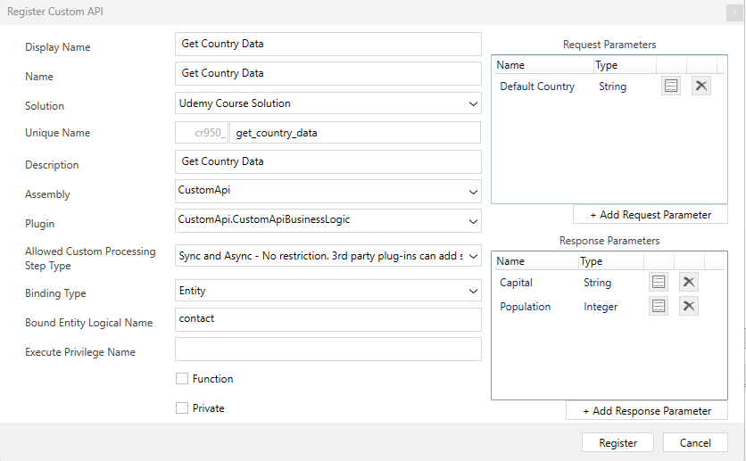
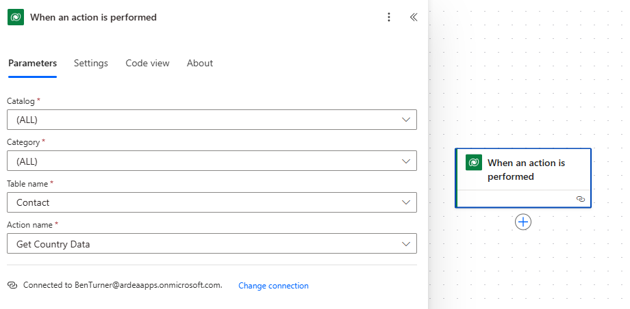
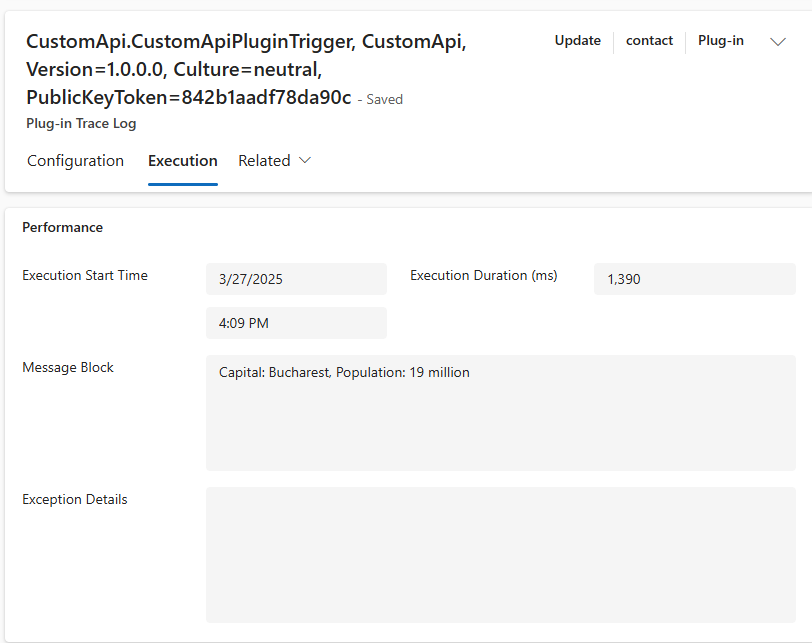
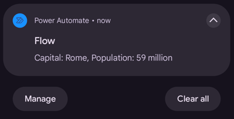

# Custom API Demonstration

## Registration

The custom api was registered using PRT.



This API is bound to the contact entity, this means that there is an implicit
Target request parameter of type EntityReference. In addition, a second input
parameter "Default Country" has been defined. This will be used if the Target
entity does not have a country set.

There are two response parameters, capital and population. The
[business logic](../resources/CustomApi/CustomApiBusinessLogic.cs) of this API
fetches data about the country and returns the capital and population.

This API has been registered as an action type. This is so that it may be
triggered by a plug-in or workflow. The plug-in property has also been added,
however, this is not required and, as mentioned in the
[notes](../2_custom_apis.md), there are good reasons not to do this.

## Usage

Since we are permitting sync and async custom processing, additional plugins may
be registered against the message.


Similarly, we can also create a Power Automate flow which runs when a custom
API message is triggered



## Triggering the Custom API

### Trigger with Plug-in

We can trigger a custom API from within a plugin:

```cs
var req = new OrganizationRequest("cr950_get_country_data")
{
    ["Target"] = target.ToEntityReference(),
    ["cr950_default_country"] = "France",
};
var res = organisationService.Execute(req);
```

For this demo, a
[trigger plugin](../resources/CustomApi/CustomApiPluginTrigger.cs) has been
created. The trigger plug-in is registered on the update step for contact and
filtered by the address1_country attribute. This plugin simply calls the Custom
API and uses the trace log to record the response.

```cs
var res = organisationService.Execute(req);

var capital = GetContextParameterOrDefault<string>(res.Results, "cr950_capital");
var population = GetContextParameterOrDefault<int>(res.Results, "cr950_population");

tracingService.Trace($"Capital: {capital}, Population: {population / 1_000_000} million");
```



### Trigger with Power Automate

We can also use Power Automate to trigger the custom API:



