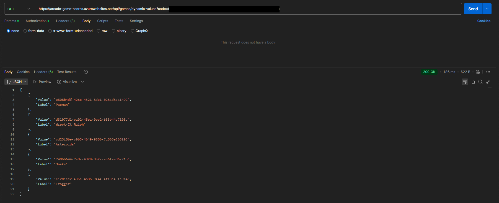

# Arcade Scores Demo

## Intro

This demonstration looks at two features of custom connectors that require the
underlying service to have supporting capabilities:

- Triggers
- Dynamic List

An API has been written to test these features. The code is not relevant to the
topic or demonstration, however, if you are interested it can be found
[here](../resources/CustomConnectors/ArcadeScoresAPI/).

## Trigger

When creating a trigger, we can use either the polling or webhook pattern. For
this demonstration I have chosen to use the webhook pattern. With the webhook
pattern, the client application registers a webhook with the service. When an
event occurs, the service will post a message to all subscribing webhooks.

In this demo, an Azure function provides an endpoint to register a webhook. The
Azure function then stores this in the database. This endpoint is described in
the custom connector as a trigger operation.

When an event occurs, e.g. a new game is added, a message is posted to an Azure
Service Bus queue. There is an Azure function, triggered by messages to this
queue, which will pass the message to a durable function orchestrator. The
durable function orchestrator, fetches all webhook subscriptions and, for each
webhook, an activity function is invoked to post the message to the webhook.

In the context of this demo, this architecture is massively over-engineered.
Instead, the post new game function could:

- get and call the webhooks directly, OR
- trigger the durable function directly

However, the architecture outlined above is more scalable as the service bus
queue can operate asynchronously and, if the durable function fails, the message
may be returned to the queue to be picked up again.

For this demo, webhooks are triggered when a new game is posted to the database:

This will trigger the sequence outlined above. When the message is posted to the
webhook, the Power Automate flow is triggered:

## Dynamic List Values

Dynamic list values are more straightforward to implement. The demo API has an
Azure Function that gets all scores for a given game. This endpoint includes the
guid of the game as a url parameter:

This would be difficult to work with in a connection. Users would need to:

- know available game types
- know the guid for the required type

To make the connector more convenient to work with, we can use the
x-ms-dynamic-list extension on a parameter:

GetGamesDynamicValues refers to an action in the connector with visibility set
to internal. Users cannot see this action but it is used under-the-hood to fetch
available values. The following is an example response from the endpoint used to
get dynamic values:

The itemValuePath and itemTitlePath attributes map the properties of response
elements to list values and titles. When a user enters a value for this
parameter they are presented with a list of human readable titles. The connector
then passes the corresponding value to the API.

