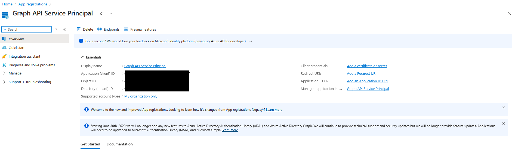
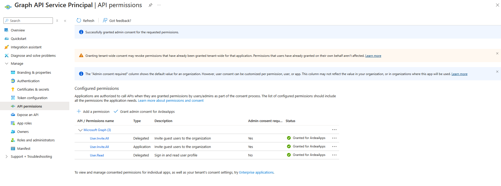
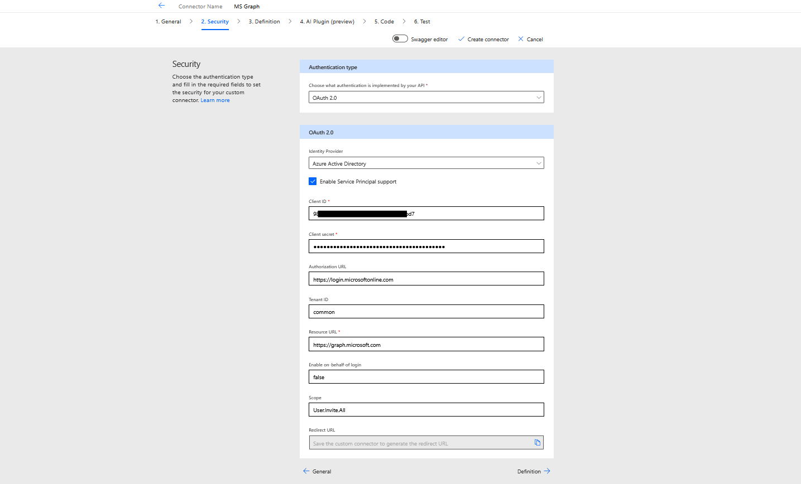
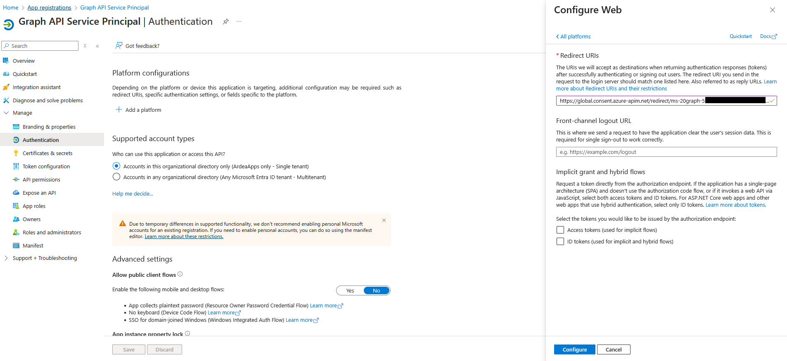
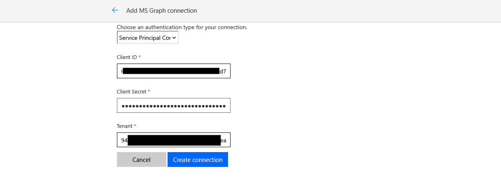
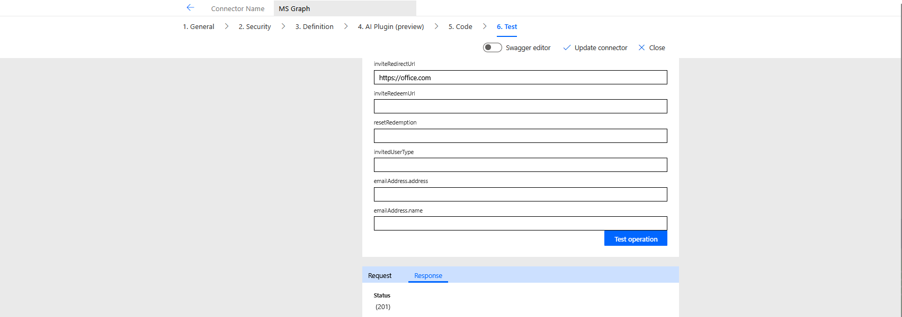

# Custom Connectors: Service Principle Authentication

Note: This demo follow a Microsoft Learn
[exercise](https://learn.microsoft.com/en-us/training/modules/use-service-principal/exercise-use-service-principal-authentication). This write-up focusses on
the security aspect only, I have not written up steps related to set up the
connector's definition.

## Create Service Principal

The first step is to create a new app registration. A service principal is
created automatically when an app registration is created.

## Storing Credentials

We will need the application id, tenant id and a client secret. The application
and tenant ids are available from the app registration overview. For the client
secret, we need to create the secret and store the value somewhere. After
creation you will not be able to see the value again.

## Set Up Permissions

Next, we need to give the service principal the required permissions. For this
exercise we need the User.Invite.All delegated and application permissions. Once
granted, we also need to select grant admin consent for as this is required for
these permissions

## Define Custom Connector Security

We now need to set-up the security for the custom connector. We need to specify
the app. Select OAuth as the type and Azure AD as the identity provider. In
the details:

- Enable service principal support
- Copy in the Service Principal client Id and secret
- Set the resource url to <https://graph.microsoft.com>
- Set the scope to User.Invite.All

Once the connector is saved, the redirect url will be populated.

## Set Up Auth on the Service Principal

Next, copy the redirect url from the custom connector security tab and return to
the service principal application registration. In the Auth section, select add
a platform and configure a web platform with the redirect url.

## Testing

Finally, we can test the connector. First set up a connection with the
credentials for the service principal.

Then run the test

