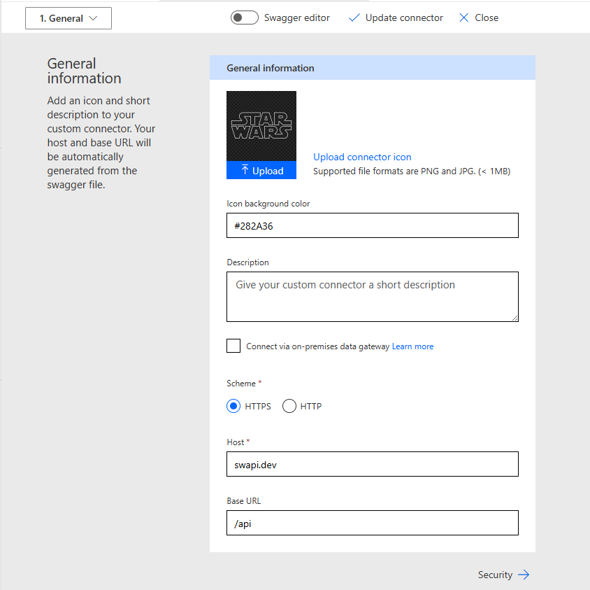
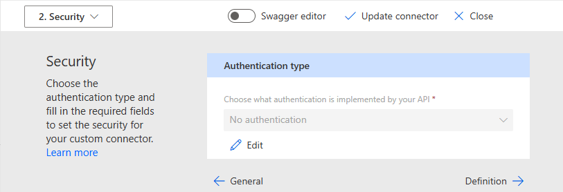
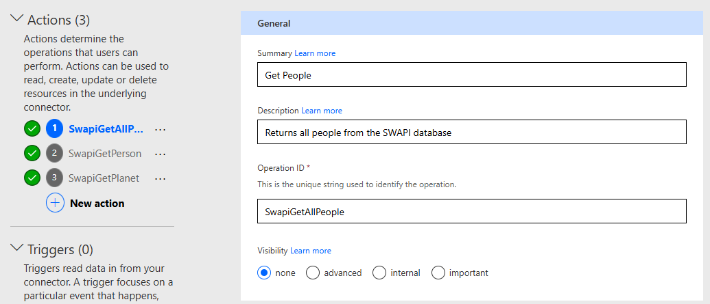
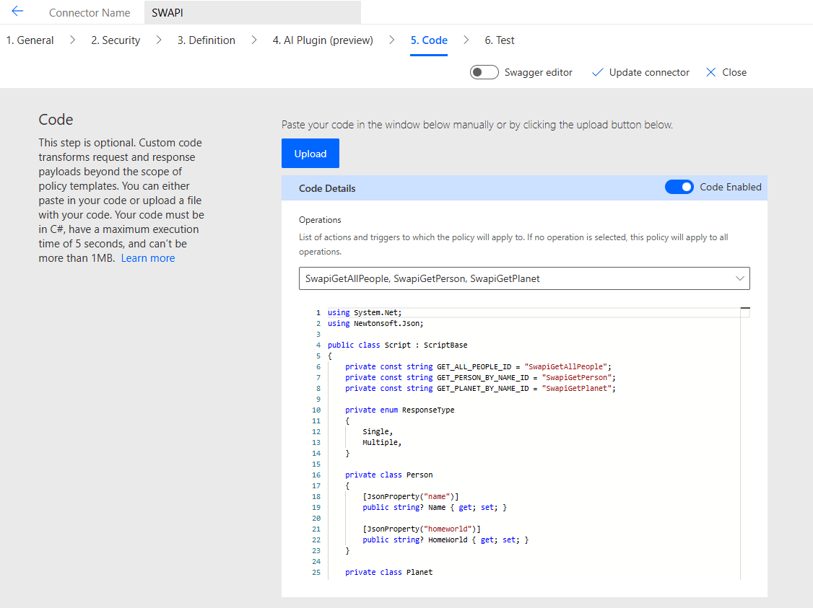
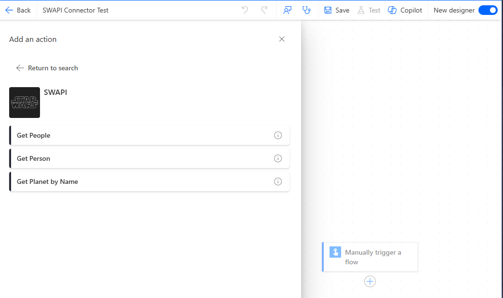
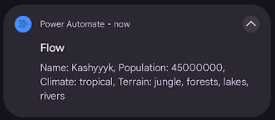

# Custom Connectors SWAPI Demo

In this demo, a custom connector is created for the pre-existing SWAPI API.

## Definition

The general tab contains some display information and high-level connection
details:

The SWAPI API does not have any authentication:

Three actions have been set-up for different endpoints.

## Custom Code

This example makes heavy use of custom code to transform the response.
Specifically, it is used to remove pagination and to change the search param
name.

However, I found that custom code in a connector is not well designed for
extensive transformations:

- We can only provide a single code block for multiple actions
- There are limited namespaces available at runtime
- The code cannot exceed 1mb
- The execution time of the code cannot exceed 5 seconds

A better approach would have been to:

- use a proxy to transform the response
- use a custom connector to connect to the proxy
- use policies to transform the query string parameters

If you are interested, the code can be found
[here](../resources/CustomConnectors/SwapiConnector/SwapiCustomLogic.cs).

## Usage

A simple flow has been created to test this custom connector:

