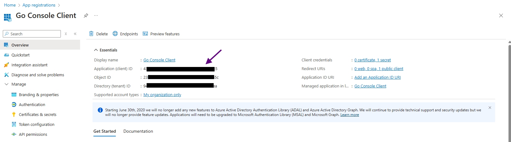
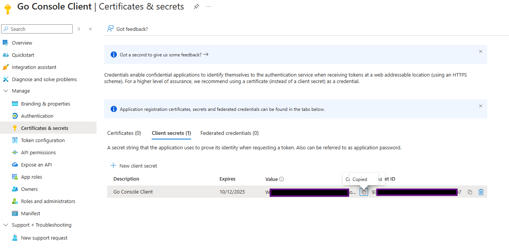

# Go oData Demo

## Introduction

Unlike OrganisationService, Web API is platform agnostic, so I decided to build
a client in Go. Looking back, the process did not teach me much about using the
WebApi. The App and the code are both pretty useless in that regard, however, I
have found the app useful when learning about authentication.

## Authentication

This demo will run the application without any credentials or Azure/Dataverse
configuration. It will work through the errors to authenticate using both app
only access and delegated access.

To start, create a .env file in the root directory of the application, as
follows

```
CLIENT_ID=
TENANT_ID=TENANT_ID
CLIENT_SECRET=
ENVIRONMENT_URL=INSTANCE URL
API_PATH=api/data/v9.2/
AUTHORITY=https://login.microsoftonline.com/
```

The two parameters, TENANT_ID and INSTANCE_URL can be accessed by navigating to
make.powerapps and selecting Session Details from the advanced settings.

Next, run the application

```bash
go run main.go
```

All being well, a menu will be shown to select an authentication mode. Press ↓
to select user and then press enter. This will start the delegated
authentication flow:


This will open a browser window, showing the following Azure AD error:


The same error is received if you add a dummy secret to the .env file, run
go run main.go again and select the Application auth mode.

### App Registration

We need to create an app registration for the client app to authenticate with
Entra ID. To do this go to portal.azure, search for app registrations and create
a new registration. For now, the defaults are used with no redirect URI set.


Once created, the client id can be copied and pasted into the .env file



### Delegated Access Config

The following two steps are only required for delegated access:

- Redirect URI
- user_impersonation permissions

Rerun the app and select user to start the delegated access flow. Once
authenticated, an error should be displayed:


To fix this we need to set-up a redirect uri on the app registration. Assuming
that the app is run locally:

- Open app registration page
- Select Authentication from the left pane
- Click "Add a platform"
- Select Mobile and Desktop Applications
- Enter <http://localhost> as a custom redirect uri


The second requirement is to grant the Dataverse CRM user_impersonation
privilege to the app registration. This is difficult to demonstrate, because the
app runs fine on my set-up without the permission.

However, the Microsoft Learn article states that:

> If your application accesses Dataverse on behalf of a signed-in user, go to
> the API permissions tab on the application registered and ensure that you
> grant your application user impersonation access to your Dataverse
> environment.


Make sure you select Grant admin consent once the permission has been added.

### App Only Access Config

The following steps are specific to App access:

- Generate a client secret
- Register an App user in Dataverse
- Grant the app user permissions

The first step is to generate the client secret. This can be done in the App
Registration Page. Once created copy the value and paste it into the .env file



This should allow the app to successfully authenticate, however, it will not be
authorised to access the resources:


To fix this, we need to add the user to the relevant environment in
admin.powerplatform.


You can add security roles when adding a user. If you get an error such as:


Add the relevant roles to the app user.

### MSAL

Microsoft provide Microsoft Authentication Libraries (MSAL) for a range of
languages and frameworks. This demo uses the Go MSAL library but they will all:

- Facilitate authentication
- Manage token caching

The code used to authenticate in the demo can be found here:

- [App only access](../resources/PlatformApis/Go_odata/msal/get_app_client.go)
- [Delegated access](../resources/PlatformApis/Go_odata/msal/get_delegated_client.go)

## OData

As noted, this project was not particularly useful for learning how to use the
WebApi. The syntax for making requests is relatively intuitive and it was simple
to:

- Create records
- Update records
- Filter records
- Delete Records
- Use pagination features


