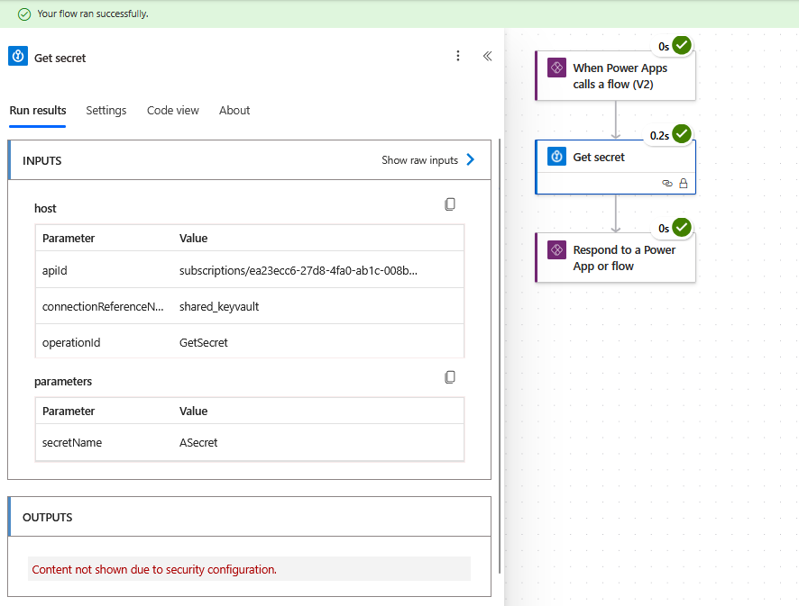

# Power Automate Flows with Key Vault

## Set-Up the Key Vault

First create a key vault in portal.azure

The vault has been set up with Azure role-based access control (RBAC) as the
permission model. To create keys, I granted myself the key vault admin role:

When the vault was created, I used Azure role-based access control (RBAC) as the
permission model. To work with the vault, I granted myself the Key Vault
Administrator role.

Next, a secret can be added to the vault:

## Using Key Vault in Power Automate

In Power Automate, a connection can now be made to key vault. To start, we will
authenticate as an interactive user.

Next we can use this connection to access a secret. The action has not been
configured correctly, so at this point the value of the secret can be seen in
the action's outputs.

To prevent this, enable secured outputs on the action:

## Using a Service Principle

We can also authenticate using a service principle. This is a more reliable
approach, we can grant roles to the key vault only to the service principle and
reduce dependency on personal accounts.

A service principle for Power Automate flows was created previously in this
[demo](./pa_sp_set_up.md). In this demo the service principle needed permissions
to run flows so we:

- Set up an app registration in azure
- Created an app user in Power Platform
- Gave the app user the necessary permissions

In this demo, we do not need to follow the last two steps, there is no need for
the service principle to have security roles in Power Platform. Instead, we need
to give the service principle a role for the key vault.

We also need to create an app secret for the service principle so that we can
authenticate as the service principle

We can now create a new connection to the key vault:

The connection has now been updated in the flow:

Having taken a screenshot of the role assignment, I forgot to click create. So,
when the flow ran for the first time a 403 error was returned:

After creating the role assignment the flow works:

