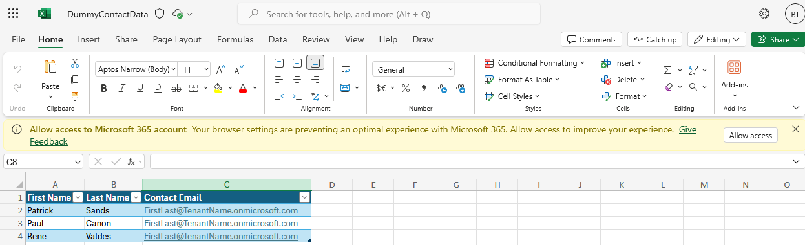
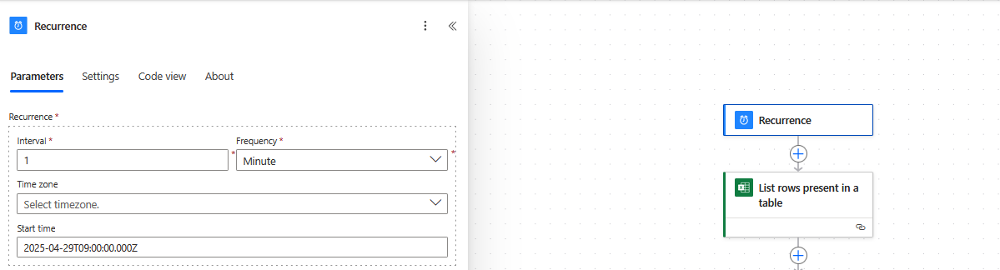
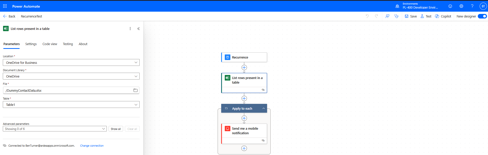
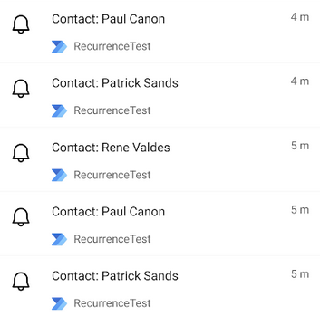

# Power Automate Flow Recurrence

This is a simple powerautomate flow based on the following MS learn activity:

<https://learn.microsoft.com/en-us/training/modules/get-started-flows/6-flow-scheduled-flows>

First create a table in excel:

Next create a flow with a recurrence trigger. I have set the trigger to run
once every minute (the frequency cannot be less than 60 seconds).

There is then an action to read rows from the table. The connector uses dynamic
values to give a dropdown of available tables. There is also a dynamic schema
for the imported table so we can access the fields without deserializing the
body

Finally, the notifications are sent:

