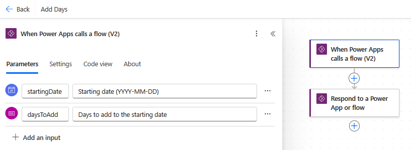
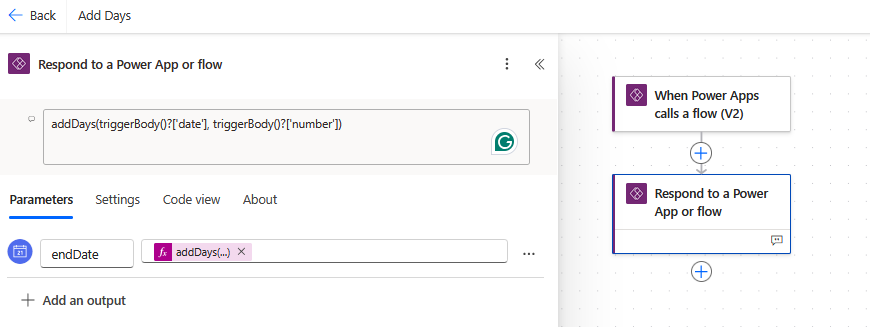
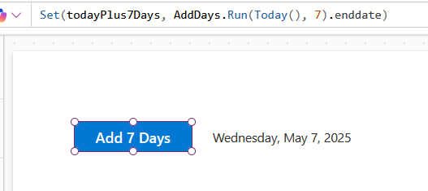
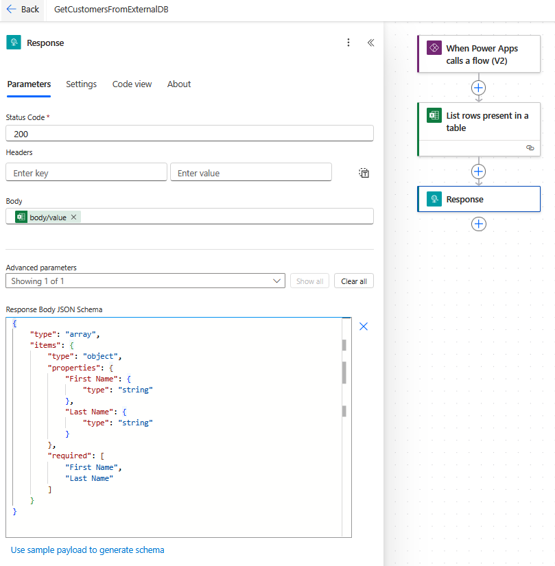
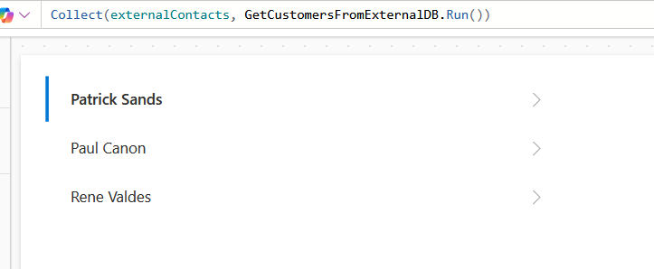

# Power Automate Flows: Returning Data Demo

This demo will look at the two actions used to return data from a flow.

## Respond to a Power App or Flow

This action is the more simple of the two. We can simply return one or more
values. The types that can be returned are limited and do not includes
collections. This demonstration flow performs an add days calculation and
returns the result:

## Response

Response is the more powerful, premium action. When using this action, we return
JSON and can optionally provide a schema to make it easier to consume. This
demonstration gets a list of contacts from an excel spreadsheet and returns the
results. You can generate a schema from JSON, so I:

- Ran the flow without a schema
- Copied the raw outputs
- Removed unnecessary properties
- Created a schema from the JSON

