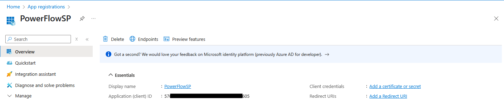
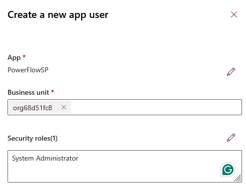
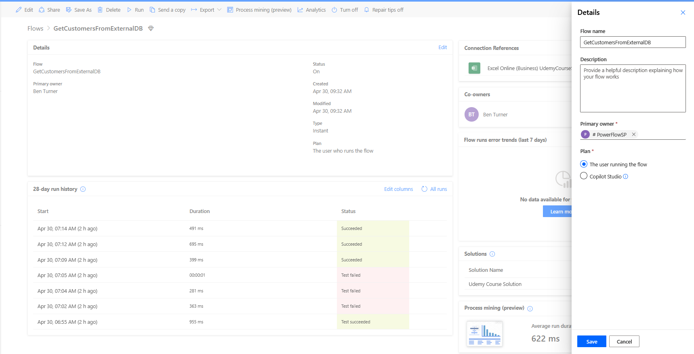

# Power Automate Flow Service Principle Owner

This is a quick demo showing how to make a service principle owned flow.

First, an app registration is created in Azure:

Next, the app is added as an app user to the Dataverse environment in
admin.powerapps:

Finally, we need to either:

- Change the primary owner to the app user
- Add the app user as a co-owner

To change the primary user, the flow must be solution aware. After adding the
flow to a solution:

