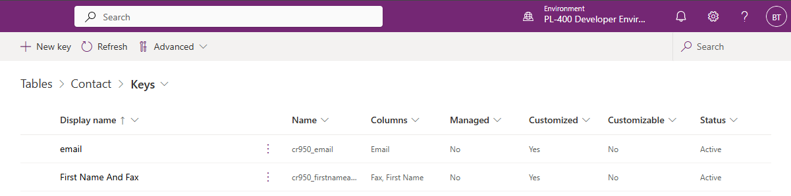
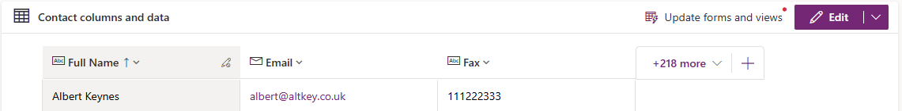
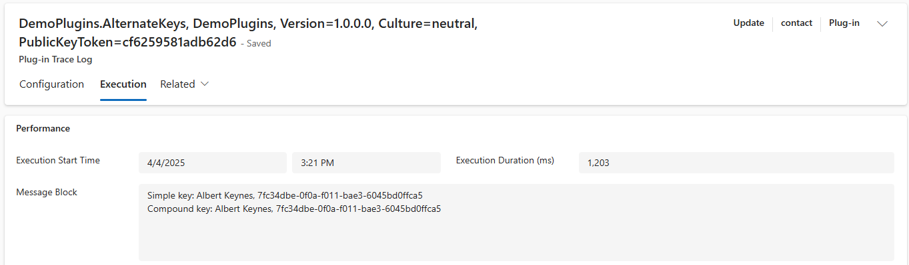

# Plug-Ins Alternate Keys Demo

This demo looks at identifying records using alternative keys. The code can be
found [here](../resources/DemoPlugins/AlternateKeys.cs).

## Set-Up

First, two keys were created for the contact table:

- Email: Simple key
- First Name and Fax: Compound key



Next a dummy contact was created:



## The Code

To access a contact using a simple key, there is an overload of the Entity
Reference Constructor that takes a key name and value:

```cs
var target = new EntityReference(
    Contact.EntityLogicalName,
    Contact.Fields.EMailAddress1,
    emailValue
);
```

To access a contact using a compound key, we need to first define a KeyAttribute
collection to store the key value pairs. We can then use this with another
overload of the Entity Reference Constructor:

```cs
var keyValues = new KeyAttributeCollection
{
    new KeyValuePair<string, object>(Contact.Fields.FirstName, firstNameValue),
    new KeyValuePair<string, object>(Contact.Fields.Fax, faxValue),
};
var target = new EntityReference(Contact.EntityLogicalName, keyValues);
```

## Trace Logs

Having retrieved the contact by both methods, the results are logged using the
tracing service:


