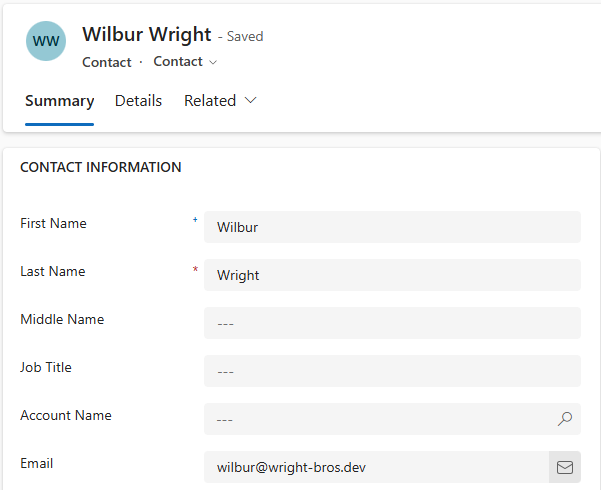
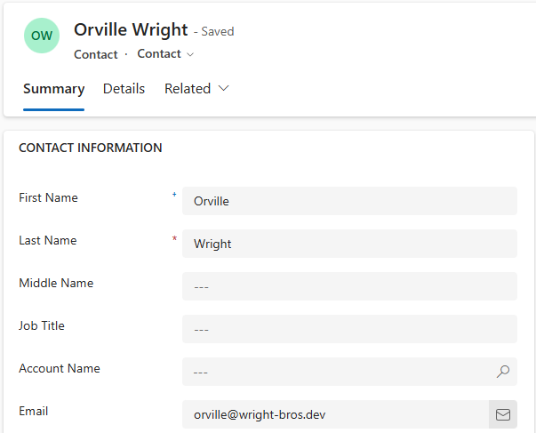

# Plug-Ins Parameter Collections

This demo looks at the input and pre-image parameter collections. The code can
be found [here](../resources/DemoPlugins/PluginParametersDemo.cs).

## The Code

This plug-in has been registered to run when the first name of a contact is
updated. It reads the email field and changes the username of the email to match
the first name of the contact.

The first name will always be present on the target entity, accessed through the
input parameters. This is because the plug-in will only run when this field is
updated and it is required so cannot be updated to null.

The email address field will not necessarily be present on the target entity.
So this is accessed using a pre-entity image.

Accessing these, without error handling, is very simple:

```cs
context.InputParameters["Target"]
context.PreEntityImages[preImageIdentifier]
```

The demonstration code uses a more long-winded approach to handle errors.

## The Functionality

### Before

Contact pre-update:



### After

Contact after updating the first name to Orville and saving the record.


