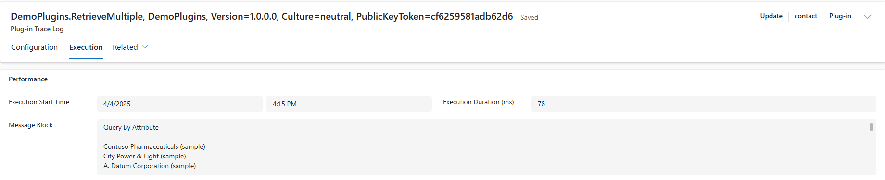

# Plug-Ins Retrieve Multiple

This demo explores the three concrete implementations of the query base class
used by retrieve multiple. The code can be found
[here](../resources/DemoPlugins/RetrieveMultiple.cs).

## Query by Attribute

This is the simplest method, it allow us to define a column set, page info and
an order. However, filtering is very limited. The demo retrieves all accounts
with a city equal to Redmond, in descending order by name

```cs
var query = new QueryByAttribute(Account.EntityLogicalName)
{
    ColumnSet = new ColumnSet(Account.Fields.Name),
    PageInfo = new PagingInfo() { Count = 50, PageNumber = 1 },
};

query.AddOrder(Account.Fields.Name, OrderType.Descending);
query.AddAttributeValue(Account.Fields.Address1_City, "Redmond");
```

The dataset:


The query results:



## Query Expression

This is similar to query by attribute, but is much more powerful. We are able to
use joins and more complex filtering criteria. The demo fetches all contacts
where the contact name contains "Sample" and the related account name contains
"Alpine".

```cs
var query = new QueryExpression(Contact.EntityLogicalName)
{
    ColumnSet = new ColumnSet(Contact.Fields.FullName),
    PageInfo = new PagingInfo() { Count = 50, PageNumber = 1 },
};

query.AddOrder(Contact.Fields.FullName, OrderType.Descending);

// Create an inner join with the account table
var accountJoin = query.AddLink(
    Account.EntityLogicalName,
    Contact.Fields.AccountId,
    Account.Fields.AccountId,
    JoinOperator.Inner
);

// Customise the join with a column set and filter
accountJoin.EntityAlias = Account.EntityLogicalName;
accountJoin.Columns = new ColumnSet(Account.Fields.Name);
accountJoin.LinkCriteria.AddCondition(
    Account.Fields.Name,
    ConditionOperator.Like,
    "%Alpine%"
);

// Standard filter on the contact table
query.Criteria.AddCondition(
    Contact.Fields.FullName,
    ConditionOperator.Like,
    "%sample%"
);
```

The dataset:


The query results:


## Fetch Expression

This is the most powerful implementation of query base, however, we need to
write raw xml which is awful. This demo groups accounts by city and aggregates
the results using count:

```cs
    tracingService.Trace($"\nFetch Expression\n");
    var queryString =
        @"<fetch aggregate='true'>
    <entity name='account'>
        <attribute name='address1_city' alias='Count' aggregate='count' />
        <attribute name='address1_city' alias='City' groupby='true' />
        <order alias='City' />
    </entity>
</fetch>";
```

The dataset:


The query results:


