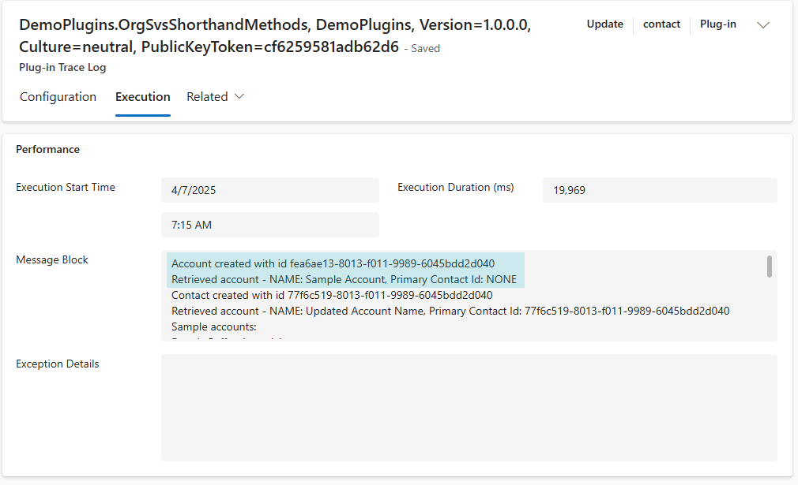
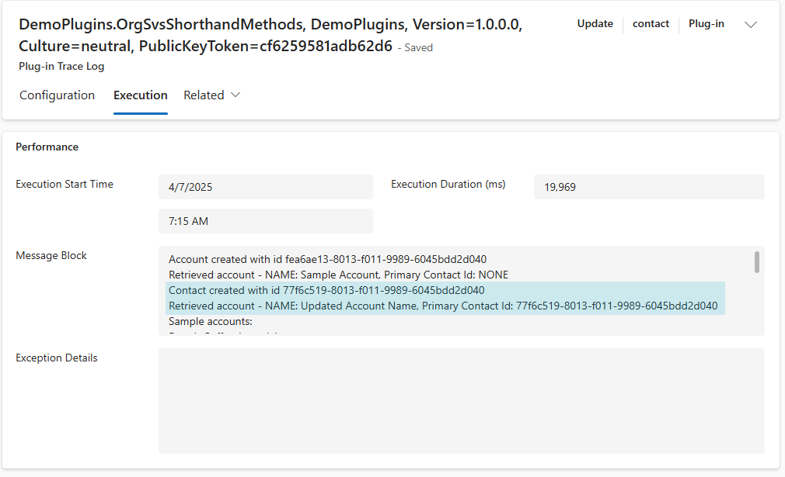
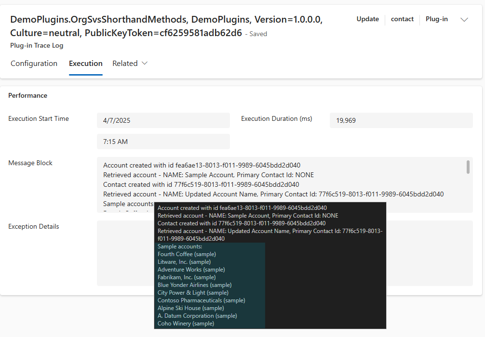

# Plug-Ins Shorthand Demos

This demo looks at the various shorthand methods in IOrganisationService. The
code can be found [here](../resources/DemoPlugins/OrgSvcShorthandMethods.cs).

## Create Sample Account

The plug-in first creates a sample account using the Create method:

```cs
var accountToCreate = new Entity(Account.EntityLogicalName);
accountToCreate[Account.Fields.Name] = "Sample Account";
var accountId = organisationService.Create(accountToCreate);
```



## Update Sample Account

The account name is updated using the Update method. An overload of the Entity
constructor is used to identify the account to be updated by guid.

```cs
var updatedAccount = new Entity(Account.EntityLogicalName, accountId);
updatedAccount[Account.Fields.Name] = "Updated Account Name";
organisationService.Update(updatedAccount);
```

A contact is also created and then associated with the sample account:

```cs
organisationService.Associate(
    Account.EntityLogicalName,
    accountId,
    new Relationship(Account.Fields.account_primary_contact),
    new EntityReferenceCollection()
    {
        new EntityReference(Contact.EntityLogicalName, contactId),
    }
);
```



## Retrieve Multiple

The sample account and contact are deleted. RetrieveMultiple is then used to
list all accounts with sample in the name. This method is covered in more detail
[here](./plug_ins_retreive_multiple.md).


