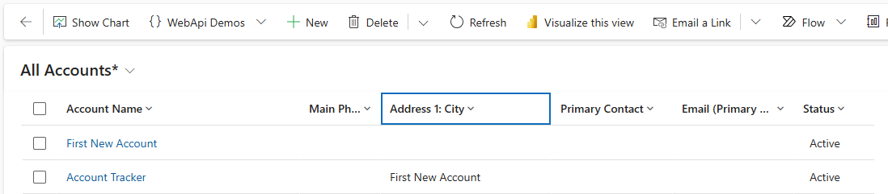
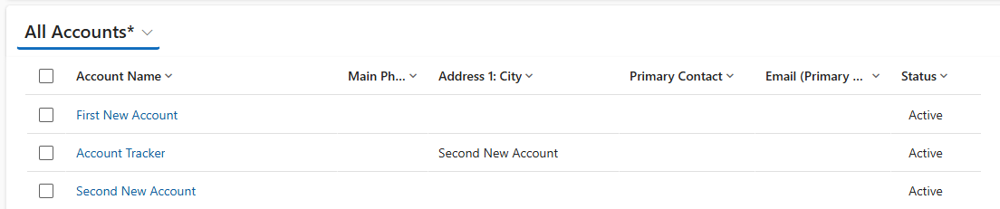

# Plug-Ins Upsert

This demo looks at the upsert request. The code can be found
[here](../resources/DemoPlugins/Upsert.cs).

## The Code

Using upsert is very simple, we just need to create an upsert request with a
Target Entity property.

```cs
var req = new UpsertRequest() { Target = accountTracker };
var res = organisationService.Execute(req) as UpsertResponse;
```

There needs to be a way of checking whether the entity already exist, e.g. using
a guid or alternate keys. In this demo, I have used the Entity constructor
overload that takes an alternate key and value:

```cs
var accountTracker = new Entity(
    Account.EntityLogicalName,
    Account.Fields.Name,
    _accountTrackerName
);
```

## The Result

The plugin has been registered against account creation. The first time an
account is created, upsert inserts an account tracker account to store the name
of the last account created.



The second time an account is created, ignoring the creation of the account
tracker account, there is already an account tracker account, so the value of
the last account created in the tracker is simply updated.



## The Reason

Like, pre and post entity images, this functionality can be used to improve
plugin performance. An upsert is a relatively common pattern, this functionality
allows the pattern to be performed in a single trip to the database.
