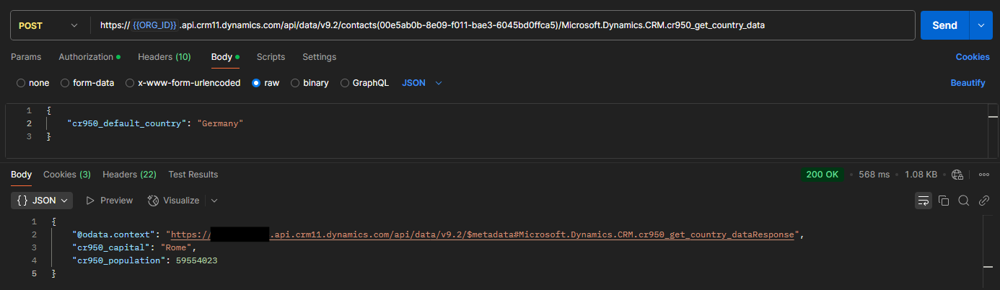
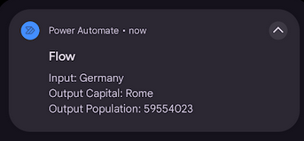

# Web Api and Custom Actions

This demo is concerned with calling custom actions from the Web Api. In this
demo:

- Web Api will be used to call a custom action
- The custom action will then trigger a power automate flow

A custom action has already been built in the
[custom api demo](./custom_api_demo.md).


This action is bound to an entity, contact, the path, to call the action is:

```url
contacts(GUID)/Microsoft.Dynamics.CRM.cr950_get_country_data
```



The default country is set to "Germany" in the request, but the response returns
information for Italy. This is because the contact associated with the guid
in the request has the country field set to Italy.

A Power Automate flow has been set to run when this message is posted. The flow
can access both the input and output parameters.


