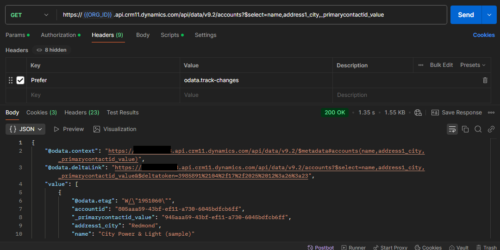
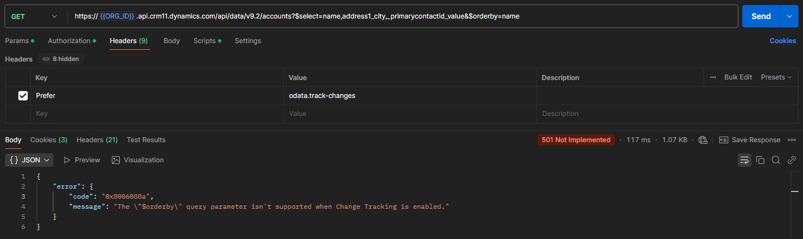
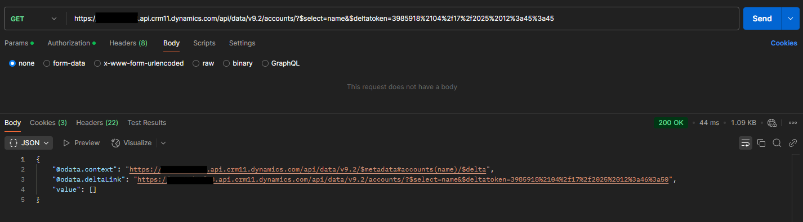
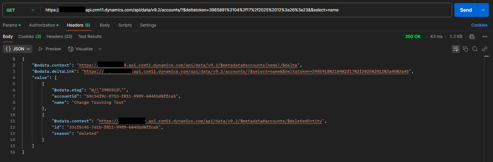
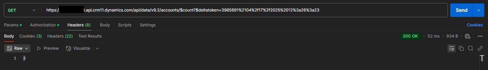

# Web API Change Tracking

Change tracking is very simple to use with the Web Api. The first step is to
get a deltatoken for a given request. This is achieved by including the
odata.track-changes value in the Prefer header

This will add the odata.deltaLink property to the response. We can use this link
directly, or extract and store the token for use later. Note that, when
odata.track-changes is in the header, we cannot use orderby in the query
parameters

If we follow the link, immediately after the request, it will likely not include
any more data. But we will get an updated delta token

After adding a new account and deleting another, the following response is
received:

We can also use count to get a count of all changes:

