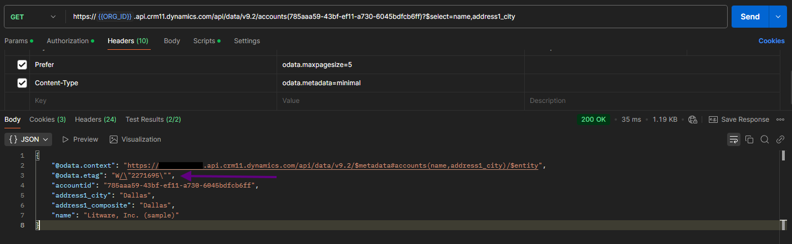
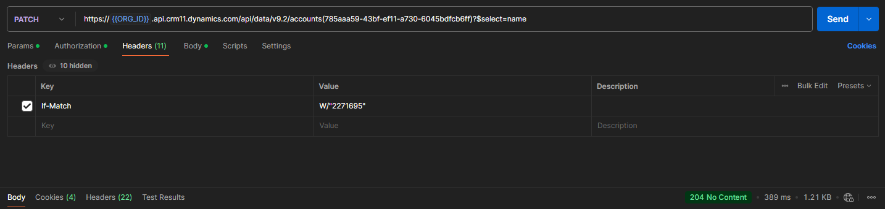
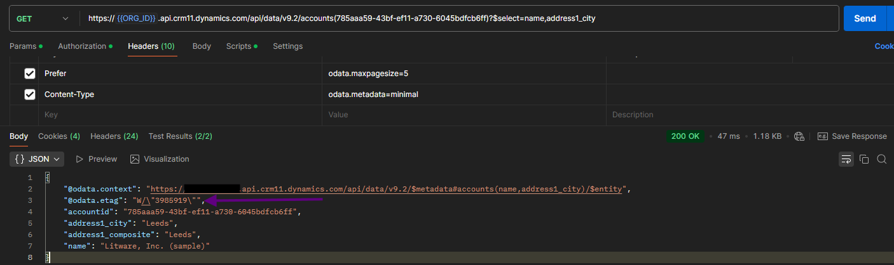
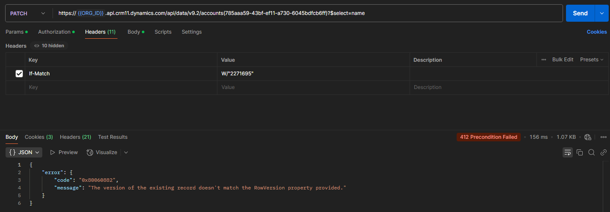

# Web API Optimistic Concurrency

To use optimistic concurrency with the Web API we need to:

- Get the version of the record we will change
- Set the If-Match header when making a change

The version of the record will be contained in the odata.etag:

We can use this tag when making a change to specify that the change should fail
if the version has changed:

This change was successful, the city has been updated and a new version number
is returned

If we try to update again using the original tag then an error will be returned:

