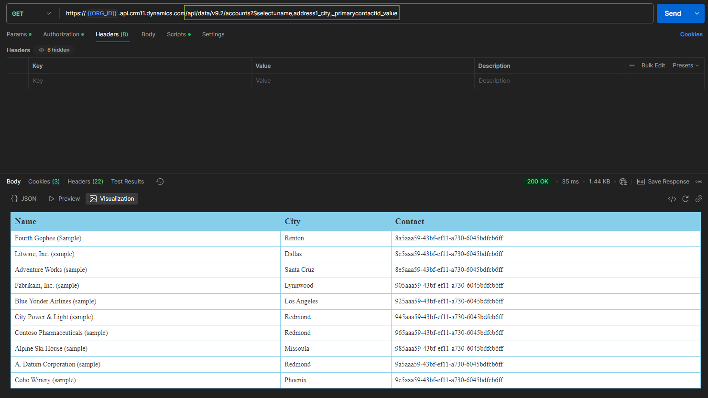

# Postman OData Demo

This demo looks at common actions performed using the Web API. Postman has been
used to keep focus on the endpoints and results, rather than code. The Go OData
[demo](./go_odata_demo.md) implements much of this in code.

## Get Many

The Web Api Endpoint looks something like:

```url
https://{{ORG_ID}}.api.crm11.dynamics.com/api/data/v9.2
```

To get many we just need to add the resource name to the path. This will be the
plural name of the table in lowercase, e.g.

```url
/accounts
```

We can also use query parameters to tailor the response. In OData, all standard
query parameter keys are prefixed with a $:

- $select   choose specific fields
- $filter   filter results
- $expand   include related entities
- $orderby  sort results
- $count    include count of entities
- $search   text search
- $top      limit number of results
- $skip     skip a number of results (not supported in Dataverse)
- $apply    aggregation (partially supported in Dataverse)

### Select

Select is simple, we just need to provide a comma-separated list of logical
names. The only complexity is with lookup columns; here we need to use the
format _logicalname_value to access the guid value.

```url
/accounts?$select=name,address1_city,_primarycontactid_value
```



### Expand

Expand can be used to populate a lookup field:

```url
accounts?$select=name,address1_city&$expand=primarycontactid($select=fullname)
```


### Pagination

Dataverse Web Api does not support skip, so pagination cannot be achieved using
a combination of top and skip. Instead, we should set a max page size header as
follows

```url
Prefer=odata.maxpagesize=5
```

This will limit the results returned to 5. If there are more results, then the
response will include an @odata.nextLink property with a url to reach the next
set of results.

Using $count=true will show the total results in the query. This can be used to
determine the total number of pages in the results


## Get One

### Get by Guid

```url
accounts(guid)
```


### Get by Simple Key

```url
accounts(name='Litware, Inc. (sample)')
```


### Get by Compound Key

```url
accounts(fax='123456789',emailaddress1='someone7@example.com')
```


## Create, Update and Delete


Delete would be as above, but:

- HTTP Method: DELETE
- Empty body

## Fetch Xml

FetchXml is not part of the OData standard, it is an MS extension. For this
demonstration, the FetchXml used for the
[plug-ins retrieve multiple demo](./plug_ins_retreive_multiple.md) has been
recycled for use with the WebApi:


