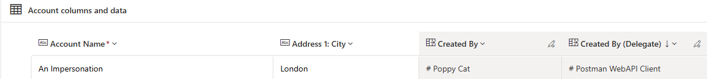

# User Impersonation Demo

This demo will create a record using user impersonation.

## Getting the Impersonated User's Entra Id

The user's Entra ID can be accessed using MS Graph:

```url
https://graph.microsoft.com/v1.0/users/USER_EMAIL_ADDRESS
```


To impersonate a user with Web Api, add a CallerObjectId header with the Entra
ID as the value to the request:


Created By will be set to the impersonated user. The Created By (Delegate) field
will be set to the impersonating entity. Note that the logical name of the
Created By (Delegate) column is createdonbehalfby.


