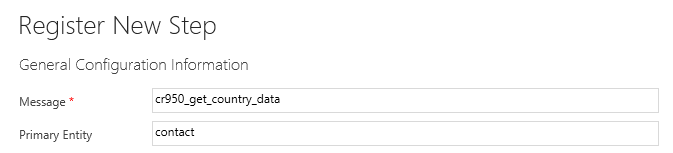
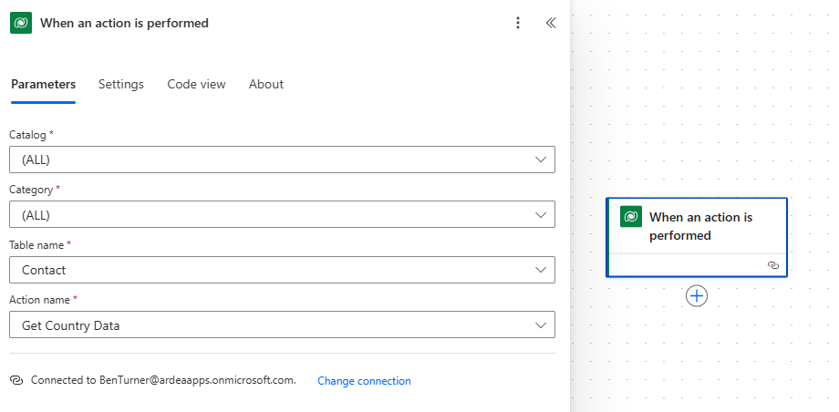
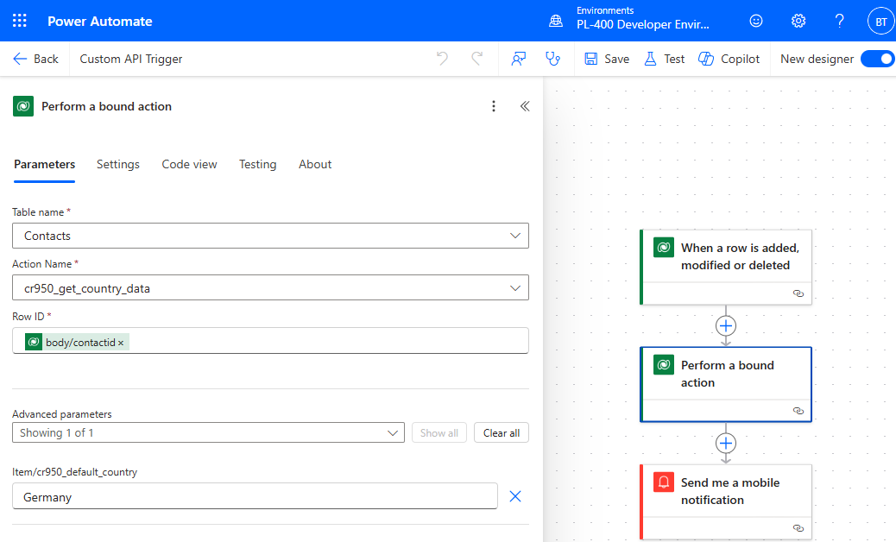
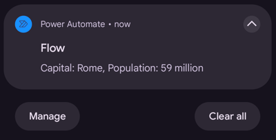

# Custom API Demonstration

## Registration

The custom api was registered using PRT.

This API is bound to the contact entity, this means that there is an implicit
Target request parameter of type EntityReference. In addition, a second input
parameter "Default Country" has been defined. This will be used if the Target
entity does not have a country set.

There are two response parameters, capital and population. The business logic of
this api fetches data about the country and returns the capital and population.

[Business logic](./CustomApiBusinessLogic.cs)

This api has been registered as an action type. This is so that it may be
triggered by a plug-in or workflow.

NOTE, adding a plug-in property is not required.

## Usage

Since we are permitting sync and async custom processing, additional plugins may
be registered against the message.

Similarly, we can also create a Power Automate flow which runs when a custom
API message is triggered

## Triggering the Custom API

### Trigger with Plug-in

We can trigger a custom api from within a plugin. I have created a plugin for
this purpose:

[Trigger plugin](./CustomApiPluginTrigger.cs)

This is registered on the update step for contact and filtered by the
address1_country attribute. This plugin simply calls the Custom API and uses the
trace log to record the response.

### Trigger with Power Automate

We can also use Power Automate to trigger the custom API:

