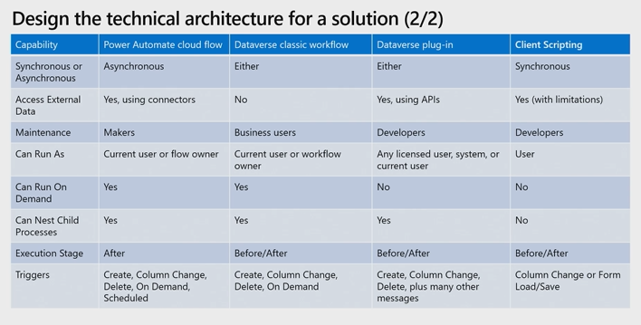

# Create a Technical Design

## Intro

Power Platform is a low-code platform with 5 main components:

- Power Apps
- Power Automate
- Power BI
- Power Pages
- Copilot Studio

These components can be used individually but they are also deeply integrated.

The general approach is focussed on low-code to enable people with different
experience levels to contribute to development. Where there are capability gaps
or more complex requirements, the platform can be extended by professional
developers using the platform's extensibility model and native Azure
integration.

To develop efficiently on the platform it is important to understand the OOTB
features and how/when to extend these.

## Power Apps Applications

### Power Apps OOTB Functionality

We can develop canvas and model-driven applications to be consumed by users.

#### Model-Driven Apps

Model-driven applications are data-driven applications built on top of
Dataverse. We can quickly create an application to work with dataverse data. We
can also work with external data sources by embedding a canvas app with
connectors to those sources.

#### Canvas Apps

We can develop canvas applications for more control over the data sources and
services we use in an application. Canvas apps can be embedded into SharePoint,
Teams, Power BI and Dynamics 365 applications.

We can also implement logic using the low-code Power Fx language.

### Power Apps Points of Extensibility

#### PCF Controls

PCF controls allow us to create code components for use in both Model-Driven
and Canvas applications. These bundle HTML, CSS, JS and other resources into a
single package that can be imported into environments. PCF controls are covered
in detail
[here](../1_extend_user_experience_10_15/2_power_apps_component_framework.md)

#### Client Scripting

We can use client scripting to extend the functionality of model-driven apps by
writing functions as event handlers for form events and as logic for command
button functions. We can also call client scripts from custom HTML web
resources.

Microsoft recommend that client scripts are developed in TS and compiled to JS.

Client scripting is covered in detail
[here](../1_extend_user_experience_10_15/1_client_scripting.md)

#### Custom Connectors

We can create custom connectors using a wizard or by importing an open API
definition, e.g. from Azure API Management or Postman. Use these if existing
connectors do not have the required capabilities. Custom connectors are covered
[here](../2_extend_the_platform_40-45/4_custom_connectors.md)

#### HTML web Resources

HTML web resources are the predecessor to PCF code components. These may be
encountered in older code bases.

## Power Automate

Power automate allows use to automate tasks and orchestrate activities. With
connectors, we can integrate with external services. The main points of
extensibility are:

- Using custom connectors
- Using workflow definition functions to build complex expressions

## Power BI

Power BI provides interactive data visualisations. The main points of
extensibility are:

- Embedding Power BI in apps, websites and portals
- Custom visuals using the open-source SKD
- Using the Power BI REST Api to run automatic data refresh etc
- Developing custom Power Query connectors

## Power Pages

This is used to create external-facing business websites allowing users outside
of an organisation to sign in and interact with Dataverse. The main areas of
extensibility are:

- Custom web page templates using HTML, CSS and Liquid
- PCF controls
- Extending site integration with Dataverse using WebApi
- Using VS Code and pac to enable metadata editing and CI/CD of site
configurations

## Copilot Studio Copilots

Copilot studio is used to create copilot agents that can answer questions from
customers, employees and other visitors to a website or service. The key points
of extensibility are:

- Building Bot Framework Skills
- Extending bots with Bot Framework Composer

## Dataverse

Dataverse is a cloud data store. This allows us to securely store and managed
data within tables. Dataverse is built on top of various technologies
including, Azure SQL, Cosmos DB and Azure storage.

There is a build in security model that allows access to data to be controlled
based on a user's roles (RBAC). We can define security at the table, row and
column level.

### Dataverse OOTB

#### Business Rules

Business rules are a declarative solution which people of any experience level
can implement. We can use these rules to:

- Validate data and show error messages
- Set and clear column values
- Set column requirement levels
- Set column visibility
- Enable or disable columns
- Create business recommendations based on business intelligence.

The last three of these are not available for Canvas Apps, but nor are scripts.

A distinct feature of business rules is that table-scoped rules will
automatically apply logic on the backend where applicable. This can provide
consistency in the application regardless of where the application is run.

Business rules have some limitations and it can be difficult to implement
complex logic with this interface. Imperative solutions include:

- Plugins
  - For complex data validation logic
- Client Scripts
  - If we need to reference data in a related table
  - Run logic on the form save event
  - If the logic is complicated to implement with business rules

#### Formula, Calculated and Roll-Up Columns

These are simple and performant ways to implement logic to created columns based
on calculations and aggregations. If any of these solutions does not meet
requirements, then a plug-in will generally be the most suitable alternative.

##### Calculated Columns

These columns are used to perform calculations, we can specify conditions and
actions. In the action section we can define a calculation using data in the
table and related tables.

These are being depreciated in favour of formula columns:

##### Formula Columns

Similar to calculated columns, we can perform real time calculations on data in
the table and related tables. Unlike Calculated columns, formulas are expressed
in PowerFx.

Both calculated and formula columns have limitations, for instance:

- Neither can have cyclical references
- Sorting is disabled where there is reference to another table, a logical or
calculated column or Now/UtcNow is used
- There is a maximum depth of 5 and 10 respectively

Calculated and formula columns only run logic on retrieve. The values of the
columns will not be updated to reflect dirty data on a form. If we would like
the values to be updated dynamically then a client side script may be considered
as an alternative or a complimentary solution.

##### Rollup Columns

These are used to aggregate data from a related table. For instance, an account
table might have a 1:N relationship with an expenses table. We could use a
rollup column to display a total of all related expenses in the account column.

Unlike calculated and formula columns, these run on a schedule (default is every
12 hours)

#### Workflows

Workflows and Power Automate flows can be used to implement logic responding to
Dataverse messages. Both components are no-code methods of building such logic.

Workflows and plugins have different capabilities and limitations:

- Workflows can run either synchronously or asynchronously. Power Automate flows
can only run asynchronously
- Workflows cannot not be scheduled
- Workflows cannot access external data sources with connectors

Imperative alternatives include:

- Plugins
- Azure Functions

In both cases we can run the functions on demand, using a custom API (plugins)
or a webhook (Azure functions). Generally, plugins will be used to extend
dataverse, but we may consider Azure functions:

- For batch processing or long-running high volume actions
- To reduce the load on dataverse
- For scheduled tasks

Note that Azure functions will never take place within a transaction so we lose
the benefit of rollback here.

##### Long-Running Tasks

To expand on the point about long running actions, we should only use
synchronous plug-ins and workflows for short running tasks:

- They are blocking
- They generally take place in a transaction and lock resources

Async plug-ins may be used for medium length actions as they take place outside
of a transaction, however they will timeout after 2 minutes.

Azure functions, particularly durable functions are better suited for long
running tasks. Azure functions timeout, by default after 5 minutes but this can
be increased to 10 minutes. With the durable functions extension we can have
tasks that run for much longer than this by building an orchestration involving
multiple Azure functions.

### Dataverse Points of Extensibility

There are a number of points of extensibility which we can use if the OOTB
capabilities are not sufficient.

#### Virtual Tables

Virtual Tables map data from an external data source enabling integration with
that data without replicating it. Developers can create data providers using
code to connect to external sources

#### Plug-Ins

Plug-ins are used to extend the functionality of Dataverse. They run as
server-side code. The main benefits of plug-ins are that:

- They can run synchronously or asynchronously
- Pre-operation plug-ins take place in a transaction allowing for rollback

Plug-ins are covered [here](../2_extend_the_platform_40-45/1_plug_ins.md)

#### Webhooks and Service Endpoints

#### Custom APIS

Custom APIS can be used to consolidate one or more operations into a custom API
that can be called from code, Power Apps canvas apps and Power Automate.

Custom APIs are covered [here](../2_extend_the_platform_40-45/2_custom_apis.md)

## Common Data Model

This is an open-sourced, standard definition of entities representing commonly
used concepts and activities. When a dataverse application is developed, a core
sent of entities are available, e.g. account and contact. There are additional
industry specific models, e.g. service which contains entities like case.

## Extending Power Platform with Azure

A number of extension points allow integration with the cloud services available
through Azure.

### Azure Functions

Azure functions may be used to offload logic outside of Dataverse. We can use
Custom Connectors to integrate Dataverse with these functions. For Azure
functions with a HTTP trigger we can integrate using:

- Custom connectors
- Calling the endpoint in code, e.g. a plug-in or client script

### API Management (APIM)

APIM allows us to manage APIS across clouds and on premises. We can also use
APIM to export API definitions directly to Power Platform. When exported a
custom connector will automatically be created.

### Service Bus

This is a Messaging as a Service (Maas) framework for real-time, asynchronous
messaging. This can be a valuable feature to integrate with external systems in
a serverless, distributed fashion.

Dataverse can be set-up to publish events to Azure service bus queues and topics
automatically using service endpoints or in code.

### Event Grid

Event grid is a managed service for managing event routing from any source to
any destination. We can use this to route events between Power Platform and
other Azure services like Azure Functions

### Logic Apps

Logic apps are a cloud service we can use to automate and orchestrate tasks. The
Power Automate service is built on top of Logic Apps and includes integration
with Power Apps and Dataverse.

We can use Logic Apps to compliment Power Automate where Power Automate does not
meet requirements, for example, to use the Enterprise integration pack or SOAP
connectors.

### AI Services

Azure AI services is a collection of AI and cognitive APIs to add AI
functionality to apps. Power Platform has an AI Builder service which is a low
code option for some of the APIS. For more complex requirements we can use
Azure AI services directly.

## Extend Power Platform with Developer Tools

Official tooling is provided through:

- Power Platform CLI (pac)
- Nuget Package Manager

There are also community tools such as XRM toolbox

### Power Platform CLI (pac)

This is a very useful tool that enables us to:

- launch other tools such as PRT and CMT
- Initialise components such as plugins and PCF controls
- Work with solutions and packages
- Deploy packages, solutions and PCF controls
- Work with custom connectors
- etc

There is also the package deployer and solution packager tools, the
functionality of these tools can be accessed with pac.

A demonstration, using the pac cli and Configuration Migration Tool can be found
[here](./demos/pac_tool_demo.md)

## Design Technical Architecture

### What we Need to Know

- Calculated Columns
  - Calculated on retrieve
  - Can use on table and columns in many to one relationship

- Rollup Columns
  - Requires one-to-many relationship
  - REcalculated every hour
  - Max 100 per env and 10 per table
  - Supports hierarchical relationships

- Logic Apps
  - Licenced pay-as-you-go (consumption) or part of service plan (standard)
  - Build in Azure Portal or VS

- Power Automate Cloud Flows
  - Licenced through 365 with quota of runs per month
  - Supports approvals and notifications

Consider both Azure

## Design the Authentication and Authorization Strategy

### What we Need to Know

- Authentication
  - Entra ID used to access Power Platform
  - Users can auth with Entra Id tenant credentials
  - When accessing Azure and external systems, we need to define how we
  authenticate against those systems (typically OAuth 2.0)
- Authorisation
  - Entra Id Security Groups
  - Dataverse security roles
  - Resource Sharing

## Assess Suitability of Out-of-the-Box Solutions

### What do we need to know?

That we should use power platform capabilities over writing code where possible
for instance with:

- Rollup columns
- Calculated columns
- Column-level security

We also need to know the limitations to understand when to use other options
such as:

- Power Automate Flows
- Classic Workflows
- Plugins

### Client Scripts Vs Calculated Columns

## Determine where to run Business Logic

Includes:

- Cloud computing
- Client-Side Processing
- Business Rules
- Plug-ins
- Power Automate

## Standard, Virtual and Elastic Containers and Connectors

### What we Need to Know

- Standard Tables
  - Structured model
  - Persistent data
  - Using business logic
- Virtual Table
  - Query external data sources
  - Enhance performance and reduce data redundancy
  - Integrate with legacy systems
- Elastic Tables
  - unstructured or semi-structured data
  - Automatic horizontal scaling
  - High volume of read/write requests
- Connectors
  - Integrate cloud services
  - Leverage APIS
  - Enable third-party integrations

## Assess Security Features

### What we Need to Know

- Data Loss Prevention Policies
  - Find and view
  - Edit
  - Delete
  - Change default data group
  - DLP Powershell commands
- Business Units
  - Root business unit
  - Hierarchical structure
  - Basis of Dataverse Security model
  - Assign Users
  - Create Teams
- Security Roles
  - RBAC
  - Default user security roles
  - Table privileges
  - Access levels
  - Permission settings
  - privacy related privileges
  - miscellaneous privileges

Includes:

- Data Loss Prevention Policies
- Security Roles
- Teams
- Business Units
- Row Sharing

    Determine the impact of security features of the Microsoft Power Platform including data loss prevention (DLP) policies, security roles, teams, business units, and row sharing on your business solution
