# Business Rules

This demo will look at the capabilities available OOTB with business rules.

## Validate data and show error messages

This first rule throws an error if the end time of a game is earlier than the
start:

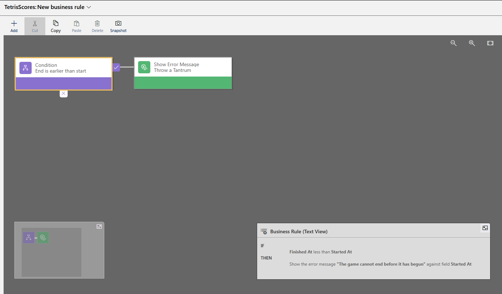

This will:

- Set an error notification on a field
- Stop the form from being saved

The rule is rerun every time one of the fields in the calculation changes

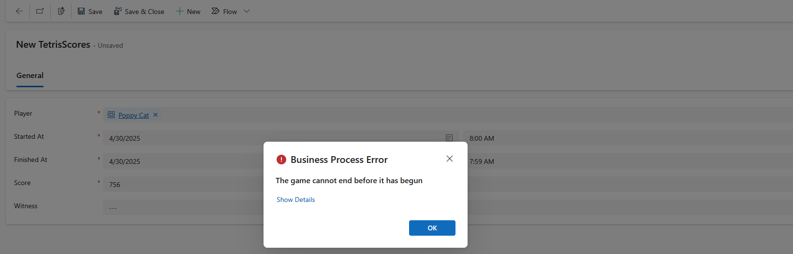

## Set and clear column values

This rule checks the player value:

- IF the player is Poppy Cat it sets pet type to Cat, ELSE
- IF the player is Rusty Dog it sets pet type to Dog, ELSE
- The value in pet type is cleared

Two things to note:

- First, again, the logic runs every time Player is updated, there is no need to
save the form to see the updates
- Second, we cannot access data in related entity fields

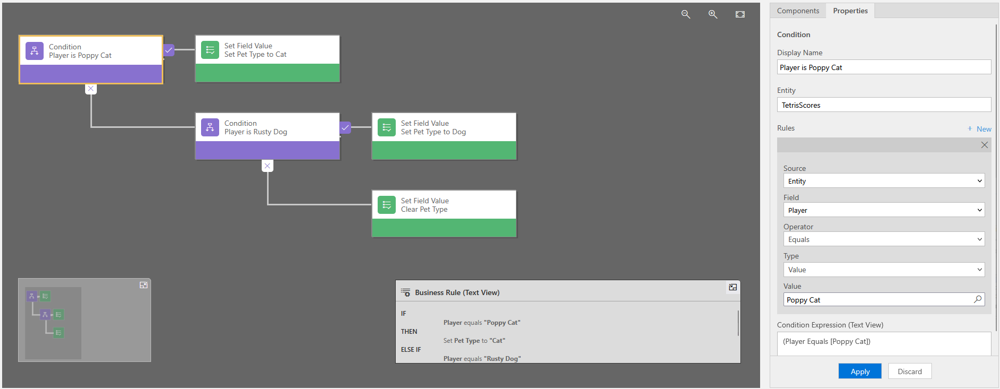

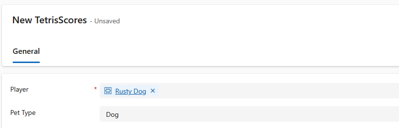

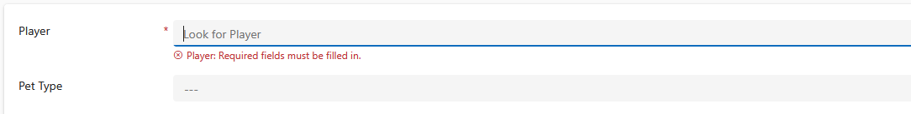

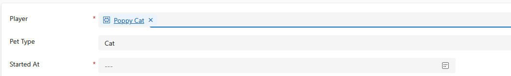

## Set column requirement levels

This rule checks the score column, if the value is greater or equal to 1,000
the witness column is set to required. Note, we can only set the requirement
level to not required or required, i.e. business recommended is not an option.

This rule revealed some weirdness. My first draft of the flow:

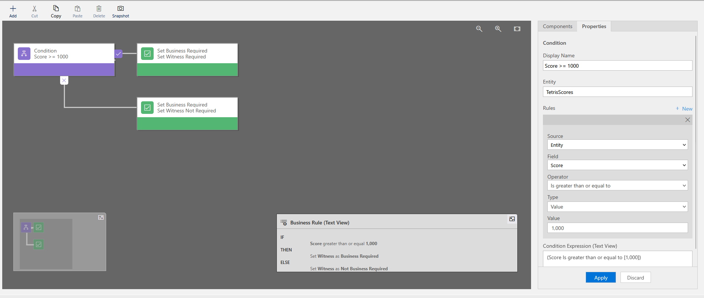

Note that when a value is entered, comma separators are added automatically.

The flow when run caused an error:

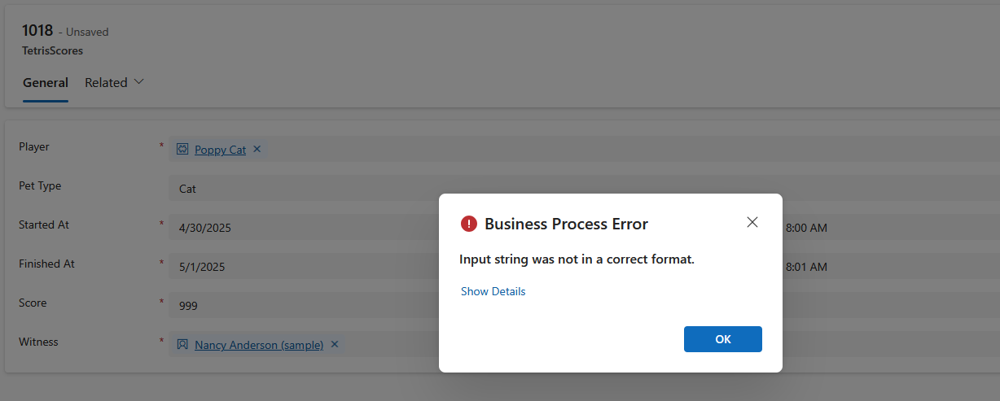

To fix this, I changed the logic so the value was 999 to get rid of the comma.

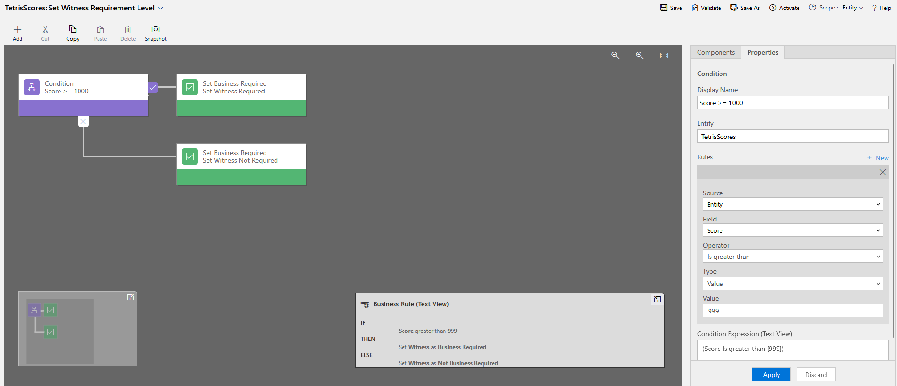

This worked:

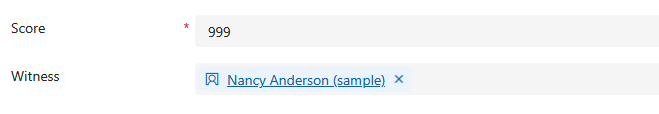
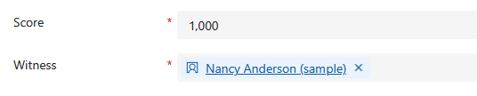

## Other Actions

The next rule uses the remaining available actions for business rules in a
single rule:

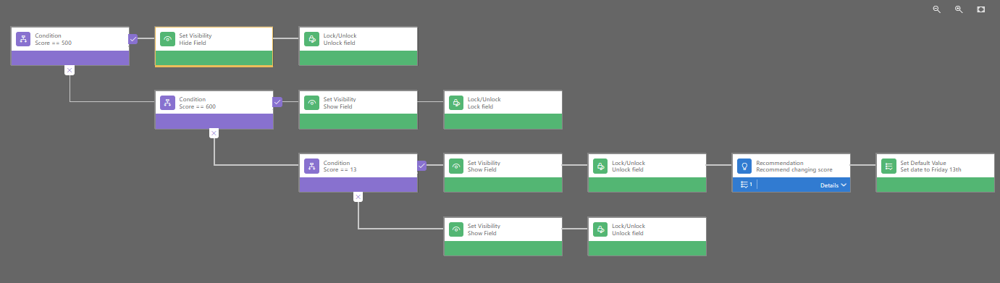

Uses column visibility to hide column to hide if score is 500:

Uses lock column to disable a column if score is 600:

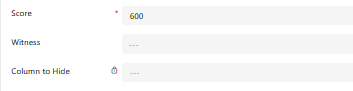

Uses a recommendation to recommend that the score change if score is 13. It will
also default the started At column to Friday 13th:

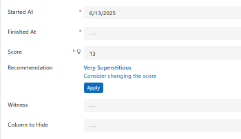

Recommendations need an action, when the recommendation is accepted the score is
changed to 666:

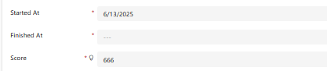

## Canvas Apps

Canvas apps have only limited support for business rules. Power Fx is probably
a better solution in this instance.

MS docs note that some of the actions are not available:

- Show or hide columns
- Enable or disable columns
- Create business recommendations based on business intelligence

It appears that rules are not applied in this context until the form is saved:

- Pet type does not update when the Player changes. Checking the table after
save, this field is set
- There is no indication that the dates are invalid until save
- Similarly, there is no indication that witness is required until save

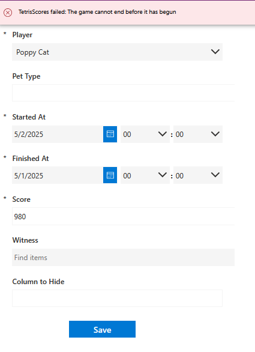
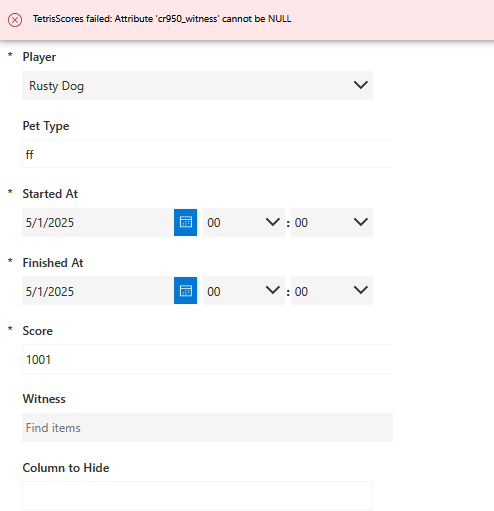
