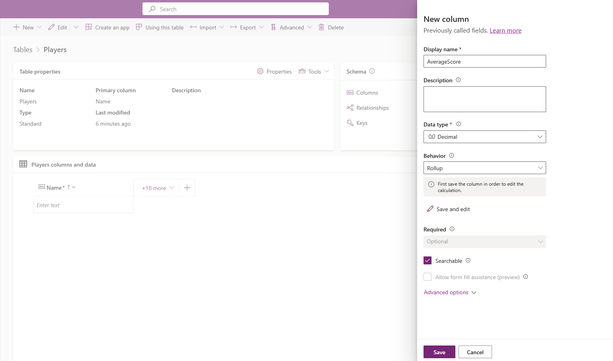
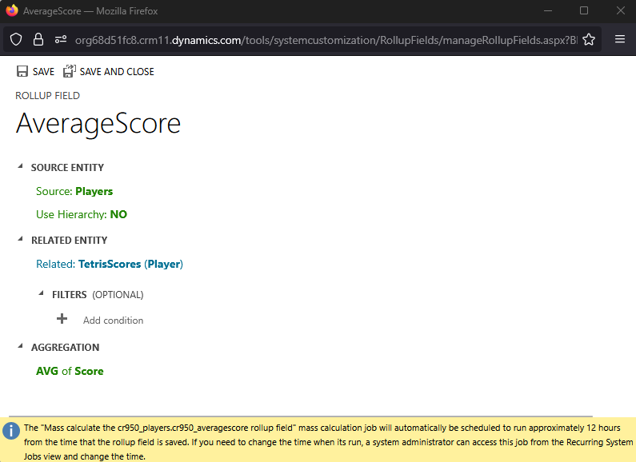
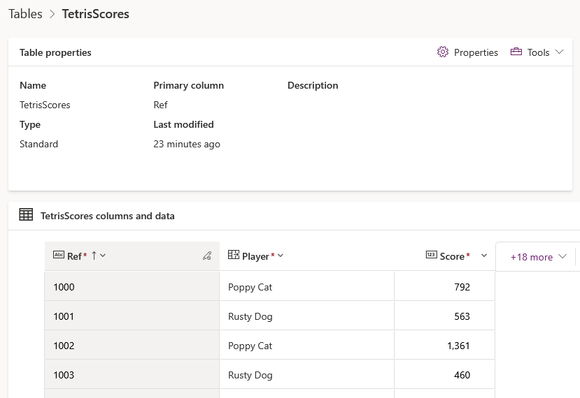
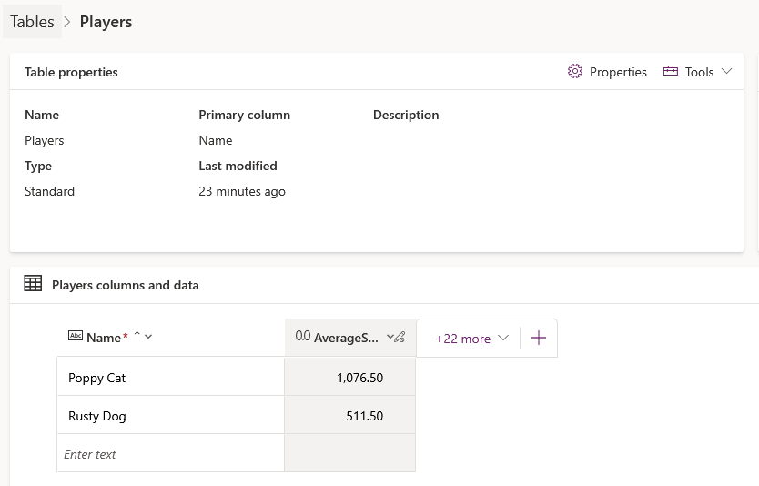
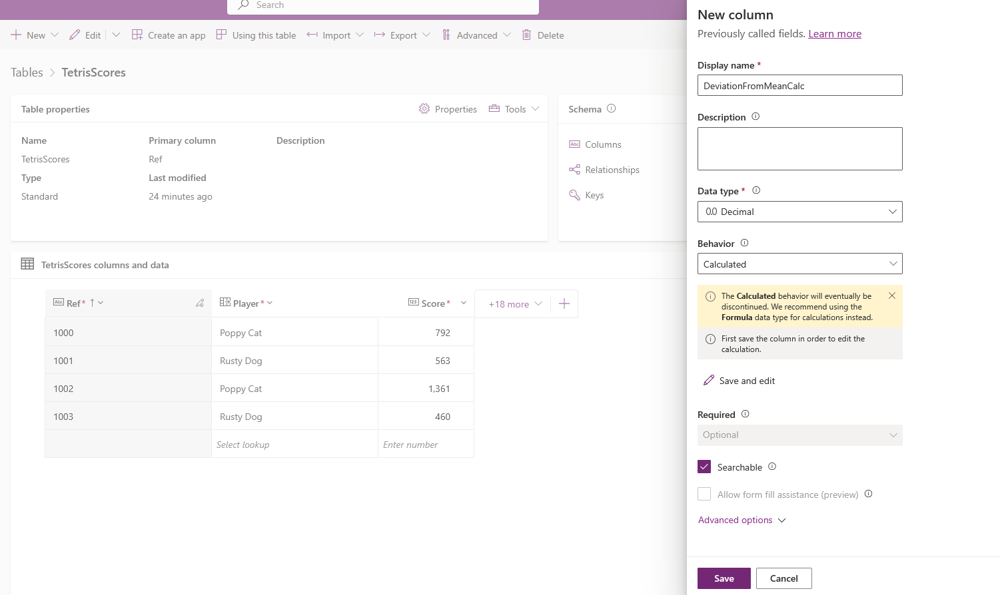
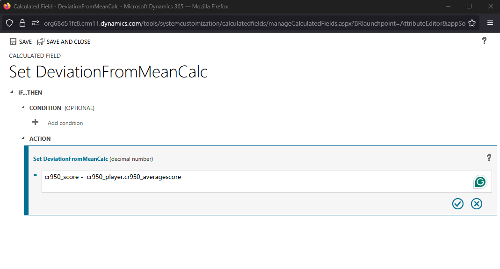
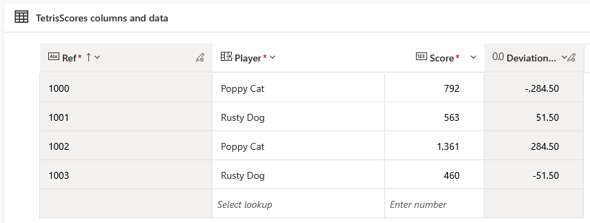
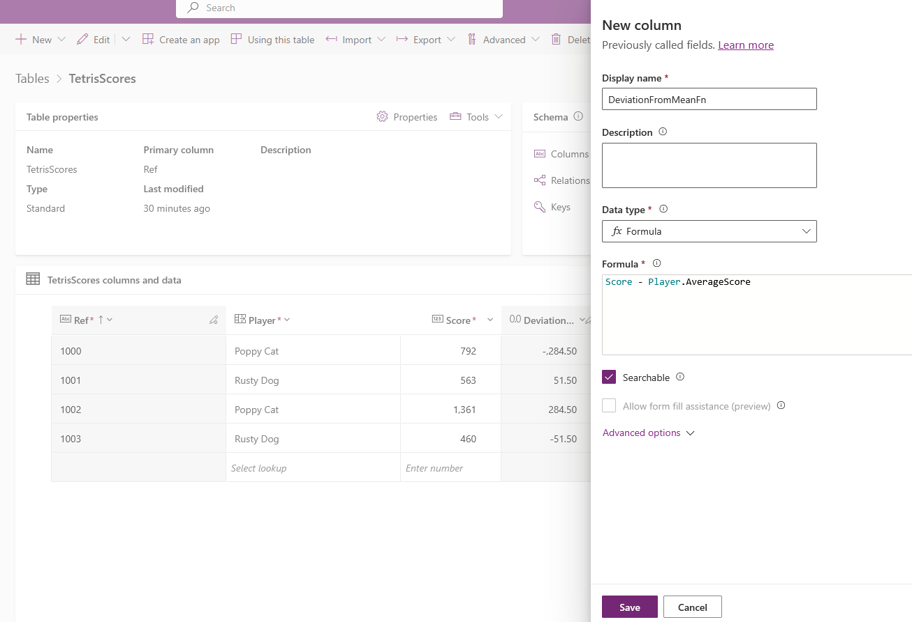
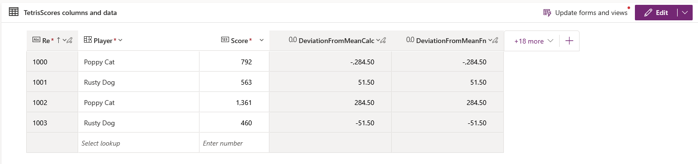

# Calculated, Formula and Rollup Columns

This is a quick demonstration to gain exposure to calculated, formula and
rollup columns.

## Rollup Columns

First a roll-up column is created, for both rollup and calculated columns it is
necessary to first create the column and then configure the logic:

Once saved, we can configure the logic. We need to define a related entity and
the aggregation method. We can optionally provide row filters. This logic gets
the player's average score from the TetrisScores table

## Calculated Columns

Next a calculated column is created, as noted above, we must create and save the
column before defining the logic. Note the warning that calculated columns have
been depreciated in favour of formula columns.

The logic calculates the score's deviation from the player's mean score. This
calculation has been chosen to demonstrate that calculated columns can reference
values in related tables.

## Formula Columns

Finally, the logic above is duplicated in a formula column. This has similar
capabilities and limitations to calculated columns but:

- We can define for logic before save
- Use Power Fx to define the logic

