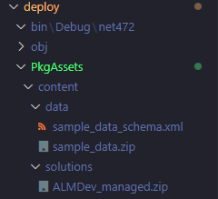

# Pac Tool Demo

## Intro

In this demonstration, the focus is on trying to implement ALM using pac cli
commands

## A Basic Flow

First, a basic flow:

- Export a solution from a dev environment and bring it into source control
- Package the environment as managed and import into a test environment
- Update the dev solution
- Sync source control
- Update the test environment with the new version

### Set-Up

I have created two environments:


Within the dev environment, an unmanaged solution has been set-up:


Finally, an app and table have been added to this unmanaged solution:


### Export the Solution

First, it is necessary to connect to the environment, to do this:

```terminal
pac auth create
```

Ultimately, the plan is to build both unmanaged and managed solutions from
source:

- Unmanaged solution when resetting the dev environment
- Managed solution to import into test

We need to export the managed and unmanaged solutions into the local file
system:

```terminal
pac solution export 
    --environment {envId} 
    --name ALMDev 
    --path ./output 
    --managed false 
    --overwrite true
```

This command can then be run a second time with the managed flag set to true

Since this is an intermediate step, before unpacking the solution, the output
directory has been gitignored.

This is an intermediate step before unpacking the solution, so the output file
has been gitignored


### Unpack the Solution into Source Control

Next, we need to unpack the files into source control. I have used packagetype
both so that we can then build into either managed or unmanaged. The zipfiles
contain metadata for each build type so both should be present in the output
directory to run this command.

```terminal
pac solution unpack 
    --zipfile ./output/ALMDev.zip 
    --folder ./src/solutions/alm-dev/ 
    --packagetype Both
```

### Commit to Feature Branch

```terminal
git checkout -b dev-branch
git add .
git commit -m "initial commit"
```

### Import the Solution to Test

First, we need to pack the solution as managed:

```terminal
pac solution pack 
    --folder ./src/solutions/alm-dev/ 
    --zipfile ./build/ALMDev_managed.zip 
    --packagetype Managed
```

Next, this can be imported into the test environment:

```terminal
pac solution import 
    --path ./build/ALMDev_managed.zip 
    --environment {ENVIRONMENT_ID}
    --publish-changes
```

After a few minutes, the solution is imported into the test environment


### Updating the App

Next a new column is added to the table in the development solution. We now need
to get this change into source control.

- Export the managed and unmanaged solutions as described above
- Unpack the solutions into the src folder

Once unpacked, we are able to see the change:


We can then:

- Stage and commit the change
- Rebuild a managed solution from source
- Import into the test environment as above

## Adding Complexity

### Data

In this section we will import both a solution and test data into the test
environment.

#### Export the data to a zip file

First, create some test data:


Next, launch the configuration migration tool:

```terminal
pac tool cmt
```

Once the tool has been opened, create a schema from the table with the sample
data and export the data to a zip file:


#### Set-Up Package Deployer

Previously, we simply imported a solution. If we want to import a more complex
package, e.g. with multiple solutions and configuration data then we need to
use package deployer.

First, initialise a package deployer project:

```terminal
cd deploy
pac package init
```

Next, I have created a content directory in PkgAssets to store the data and
built solution files:



To add a solution, using pac:

```terminal
pac package add-solution --path ./PkgAssets/content/solutions/ALMDev_managed.zip
```

To add the data edit the ImportConfig file to add a path with the
crmmigdataimportfile attribute:

```xml
<?xml version="1.0" encoding="utf-8"  ?>
<configdatastorage 
  installsampledata="false" 
  waitforsampledatatoinstall="true" 
  crmmigdataimportfile="./content/data/sample_data.zip">
  <solutions>
  <!-- Populated at build time  -->
  </solutions>
  <filestoimport>
  </filestoimport>
  <filesmapstoimport>
  </filesmapstoimport>
</configdatastorage>
```

#### Deploy the Package

Build:

```terminal
dotnet publish
```

Deploy:

```terminal
pac package deploy 
    --environment {ENV_ID}
    --package bin/Debug/deploy.1.0.0.pdpkg.zip
```

Success:


### Teams and Security Roles

In this section the plan is to:

- Reset the environment
- Deploy a package with a solution, test data and teams associated with security
roles

#### Resetting an Environment

This is very simple and very slow:

```terminal
pac admin reset --environment {ENV_ID}
```

#### Create Azure Security Group

In portal.azure I have created two security groups. The purpose of this is to
simplify role assignment. Users are added to the Azure security group and
permissions are then granted to the team.


The basic group contains two members, the admin group contains one member. The
intention is to give different permissions to the two different groups.

#### Create Dynamics Security Roles

Next two security roles in the dev environment using admin.powerplatform:


When an environment is reset, the security roles are also reset. So we need to
add the security roles to the solution.


Next, the process described above is followed to get the updates into source
control and build a new managed solution from source.

#### Adding Teams with Code

pac package init scaffolds the project with a PackageImportExtension.cs file.
We can use the override for AfterPrimaryImport to add the security roles in
code:

```cs
public override bool AfterPrimaryImport()
{
    CreateTeams();
    return true;
}
```

Create Teams just calls Create Team with the required details:

- A name for the team
- A Guid for the team
- A Guid for the Entra Id security group the team is associated with
- A Guid for the business unit that the team belongs to
- Guids for the security roles to be assigned to the team

```cs
private void CreateTeams()
{
    CreateTeam(
        "ALM Basic Users",
        basicUserTeamId,
        almSecurityGroupObjectId,
        businessUnitId,
        new Guid[] { basicUserRoleId }
    );
    CreateTeam(
        "ALM Admin Users",
        adminUserTeamId,
        almAdminSecurityGroupObjectId,
        businessUnitId,
        new Guid[] { basicUserRoleId, adminUserRoleId }
    );
}
```

Create Team generates an Entity for the team and uses upsert to add the team to
the environment. This ensures that if the team exists already in the environment
an error will not be thrown.

```cs
private void CreateTeam(
    string teamName,
    Guid teamId,
    Guid entraSecurityGroupId,
    Guid businessUnitId,
    Guid[] roleIds
)
{
    Entity team = new Entity("team", teamId);
    team["name"] = teamName;
    team["teamtype"] = new OptionSetValue(2); // Security Group
    team["azureactivedirectoryobjectid"] = entraSecurityGroupId;
    team["businessunitid"] = new EntityReference("businessunit", businessUnitId);

    var upsertRequest = new UpsertRequest { Target = team };
    CrmSvc.Execute(upsertRequest);

    AssignRolesToTeam(teamId, roleIds);
}
```

Assign roles to the team just creates associates the team record with each of
the role ids passed in.

```CS
private void AssignRolesToTeam(Guid teamId, Guid[] roleIds)
{
    foreach (var roleID in roleIds)
    {
        var relationship = new Relationship("teamroles_association");
        CrmSvc.Associate(
            "team",
            teamId,
            relationship,
            new EntityReferenceCollection { new EntityReference("role", roleID) }
        );
    }
}
```

After importing the package the teams are created and associated with the
relevant Azure security group:


The teams also have the correct roles assigned:


### Plug-ins

A simple plug-in has been created. This is in the src folder, but it is not in
the solutions directory. This is so the code is unaffected when a solution is
unpacked to the solutions folder.

The plug-in has been registered in the dev environment against the create step
when a new game score is created. It will throw an error if the player's name
is Poppy Cat and the score is < 500


After bringing the changes into source control:


The dll has been gitignored, the plan is to build from source before packaging
the solution.

Finally, to get the new version into the test environment:

- pack a managed solution from source
- rebuild the package with dotnet publish -c Release
- deploy the new package

### Web-Resources

I have created a simple web-resource. The src code is in Typescript and it is
compiled to the dist folder.

The logic is the same as for the plug-in, it just shows a notification if the
player's name is Poppy Cat and the score is < 500

As with plug-ins, one the resource is added to the solution, it will be included
in source after extract.

There is probably a more complicated, best practice way to do this, but
essentially this was no different to any other change, other than keeping TS
in source control in a folder that is not extracted to.

Not a web-resource issue, but if you do not update the version number of the
dev solution before export then when the package is deployed the solution import
will be skipped if already present in the target environment.
