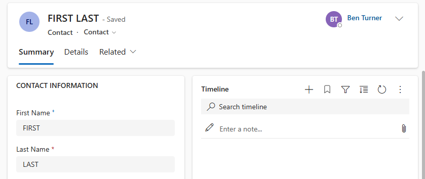
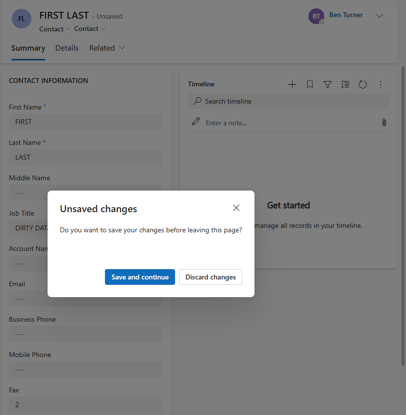
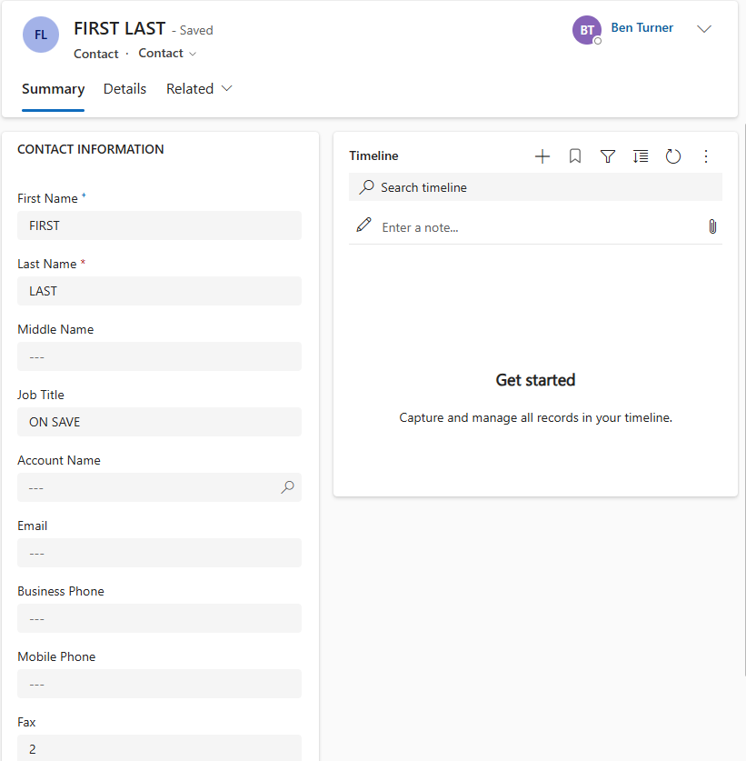
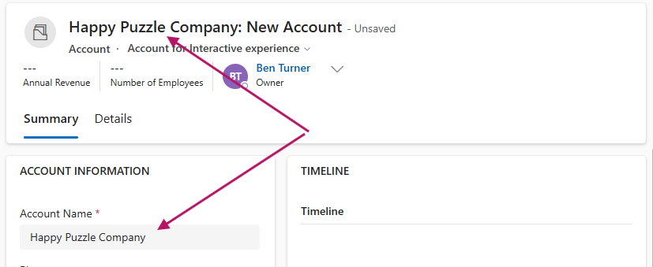
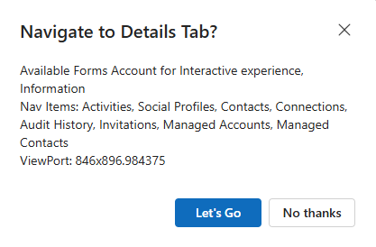
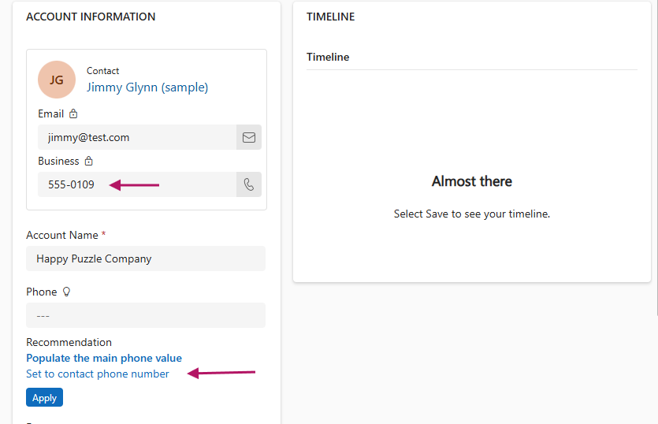
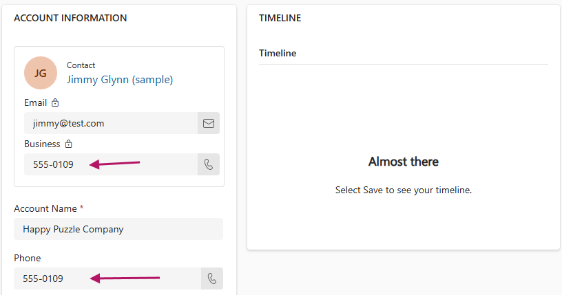

# Form Context Scripting Demos

## [Form Context Data](./form_context_data_demo.js)

This demo focusses on formContext.data. The script exposes one method,
contactFormLoadHandler.

### IsValid and Setting Data

The data.isValid method is used to check the validity of the form. If the form
is not valid it uses data.entity.attributes.get to access and set the first and
last name fields. Note, context.getAttribute() is an alias for this method.

The job title field is also set to ON LOAD to indicate the handler from which it
was set.

### Programmatic Handler Registration

A post-save handler is registered programmatically using
data.entity.addOnPostSave.

### Is Dirty and Save

The onLoad handler finishes its execution by calling the private method,
saveContactFormIfDirty. This method is used to demonstrate the
data.isDirty method. It calls isDirty to check for unsaved changes on the form.
If there are unsaved changes then it calls data.save. It also increments a
saveCount stored in the fax field to show the number of saves.

Since the onLoad handler has set a number of fields, the form state is dirty and
the form will be saved. This will trigger a call to the post save handler.

The post save handler changes the job title field to ON SAVE and recalls
saveContactFormIfDirty. Job title has been changed so the form is saved. This
triggers the post save handler for a second time.

On the second run, job title is again set to OnSave, however, the form state
will be unchanged from the last run so saveContactFormIfDirty will not save the
form and the save count will not be incremented.

### Refresh Form

On the second run of the post save handler, the count of saves, stored in the
fax field, is 2. When the save count equals 2, the post save handler sets the
job title to DIRTY DATA and uses data.refresh to refresh the form.

This triggers a confirmation dialog to warn that unsaved data will be lost.
Selecting discard changes will reset dirty fields.

## [Form Context UI](./form_context_ui_demo.js)

This demo is focussed on FormContext.ui. This exposes a single on load handler
which registers a number of on change handlers to various fields on the form.
This script is used on an account form.

### Form Name

The first handler uses the data.entity.getPrimaryAttributeValue method to access
the value of the name field.

The ui.setFormEntityName is used to update the title of the form.

### Tabs and Metadata

The second handler accesses metadata on the form with:

- ui.formSelector.items
- ui.navigation.items
- ui.getViewPortWidth/Height

It then displays this information in a confirmation dialogue. If confirm is
selected ui.tabs.get is used to select the details tab. The setFocus method on
the tab is then invoked to navigate to that tab.

### Column Level Notification

The third handler uses form level notifications. These allow us to show a
notification on a field with suggested actions.

When the primary contact field changes, a notification is displayed recommending
setting the account phone number to:

- the contact's phone number, OR
- a default if the contact has no phone number

