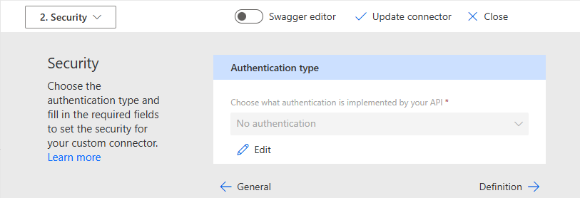

# Custom Connectors Demo

## SWAPI Custom Connector

### SWAPI Custom Connector: Creation

In this first demo a connector has been created for the existing SWAPI API.

The general tab contains some display information and high-level connection
details:

The SWAPI API does not have any authentication:

Three actions have been set-up for different endpoints.

Code has been used to transform the response to make it nicer to use from Power
Apps. Specifically, to remove pagination and to change the search param name.
The code can be found [here](./SwapiConnector/SwapiCustomLogic.cs).

Custom code in a connector is not really designed for extensive transformations
and we can only provide a single code block regardless of the number of actions.
Other limits include:

- Limited namespaces available at runtime
- Size restrictions (no more than 1mb)
- Execution time restriction (no more than 5s)

A better approach would have been to use a proxy to transform the response and
create a custom connector to the proxy. This would have been trivial with an
Azure Function.

### SWAPI Custom Connector: Usage

A simple flow has been created to test this custom connector:

