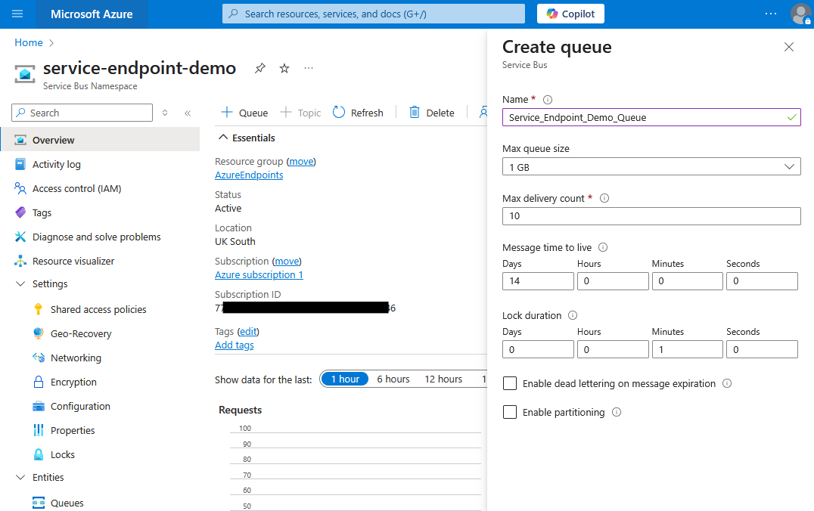
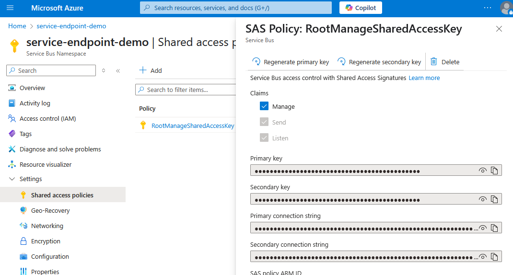
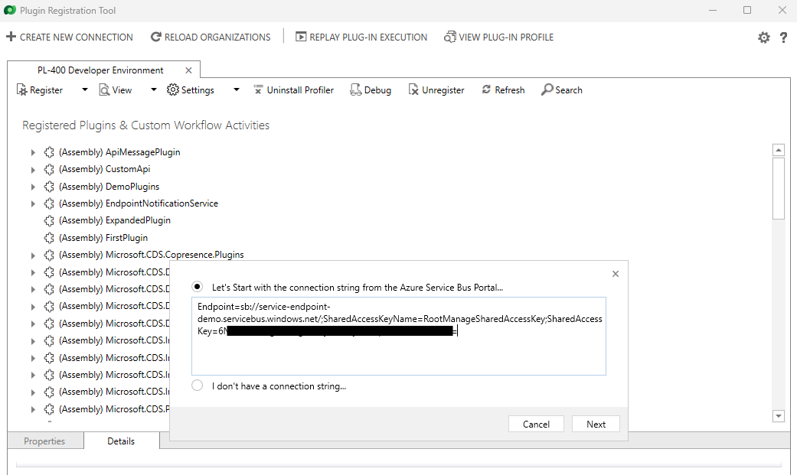
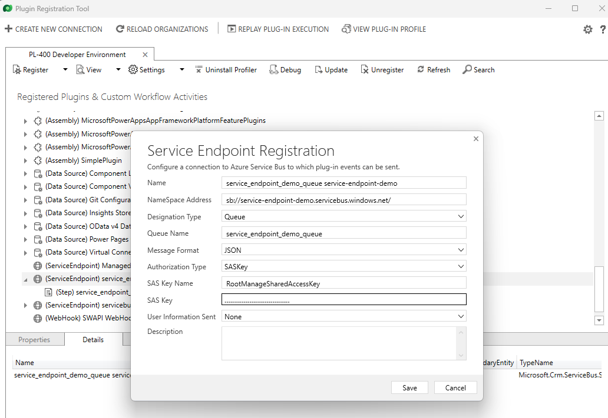
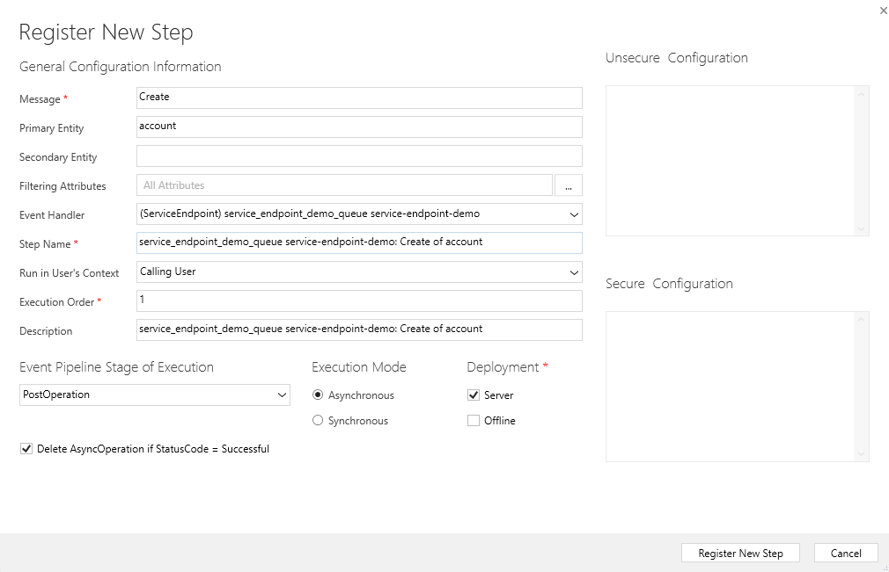
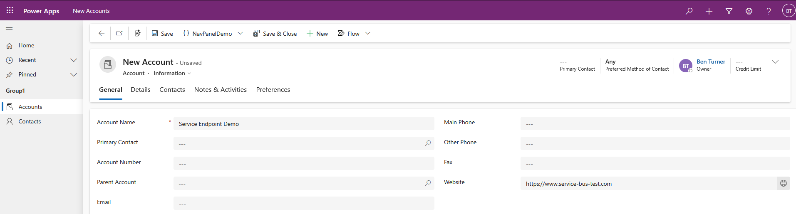
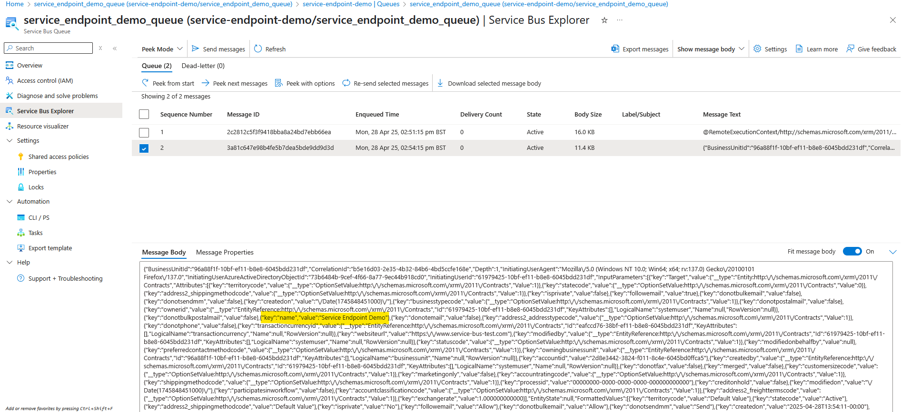

# Publishing Dataverse Data To Service Bus with Service Endpoint Registration

This demo will create a service endpoint to publish dataverse data to an Azure
Service Bus queue.

## 1. Creating a Service Bus Queue

First, we need a service bus queue:

- Create a service bus in portal.azure
- Once created add a queue

To authenticate with the Service Bus, we use Shared Access Signatures (SAS).
Select shared access policies and copy the primary connection string for the
RootManageSharedAccessKey.

## 2. Register Service Endpoint

Next, open PRT to create a service endpoint. This will prompt us to add the
connection string for the endpoint:

### Designation Type

There are various designation types:

- Queue: Post to a messaging queue in the cloud. No active listener is required
- One-Way: This requires an active listener. If no active listener the post will
fail after a number of retries
- Two-Way: As above but a string value can be returned from the listener to the
plug-in or custom workflow activity initiating the post
- REST: Like two-way but on a REST endpoint
- Topic: Like queue but active listeners can subscribe to receive messages from
the topic
- Event Hub: Relates to event hub integrations

### Queue Name

The connection string relates to the service bus. However a service bus can
contain multiple queues. Accordingly it is necessary to specify the queue to
post to.

This parameter is only present if we select queue as the designation type

### Message Format

We can select:

- JSON
- XML
- .NETBinary

Generally, we will use JSON as the message format

### User Information Sent

We can select either none or userid.

## 3. Register a Step

## 4. Test the Integration

To test the integration, we can create an account to trigger the step.

This will then add a message to the queue with the record json:

