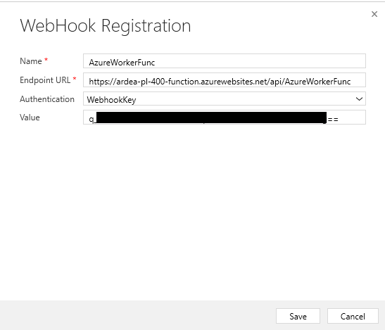
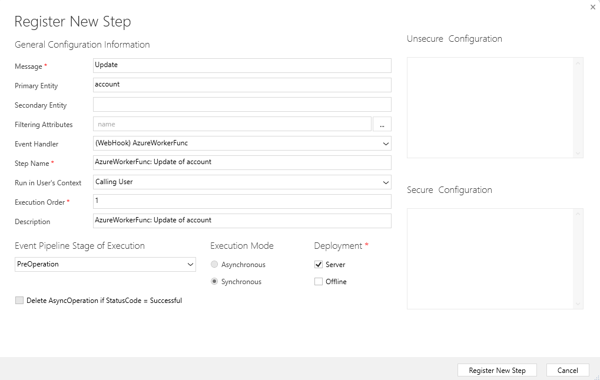
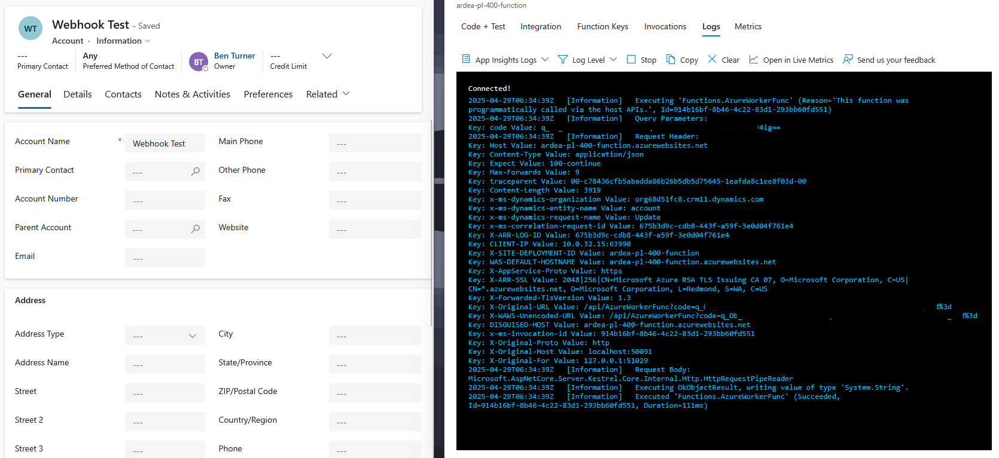

# Webhook demo

This demo simply follows the activity described
[here](https://learn.microsoft.com/en-us/training/modules/integrate-dataverse-azure-solutions/azure-function),
with a few minor modifications.

## Create an Azure Function

A simple Azure function has been produced. This just logs some information from
the request.

## Register Webhook

In PRT register a webhook. We need to provide the function url and set
authentication. Azure functions use WebhookKeys which are sent in the query
string parameters as code={webhookKey}.

Next we register a step, here a synchronous step has been chosen:

## Testing

Finally, we can trigger the step and view the logs from the Azure Function:

